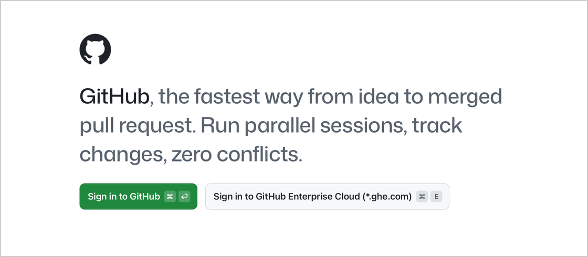
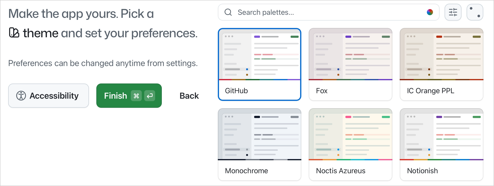
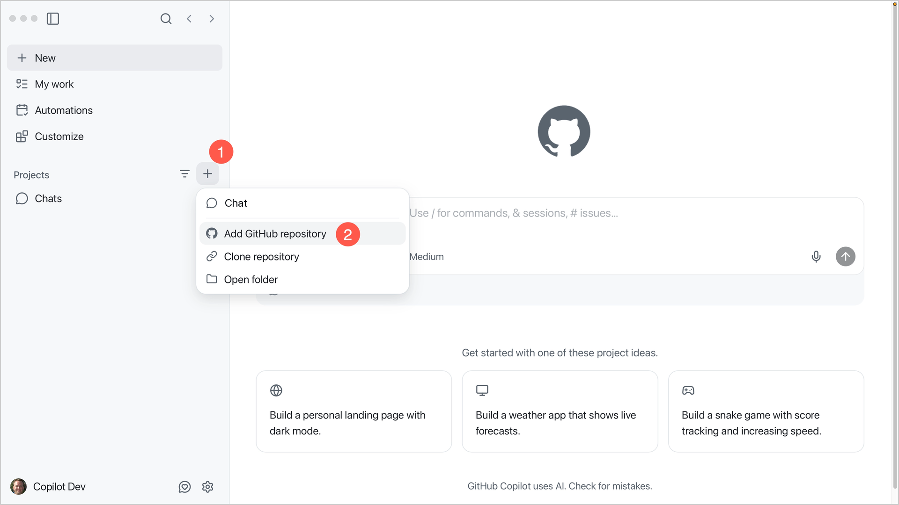
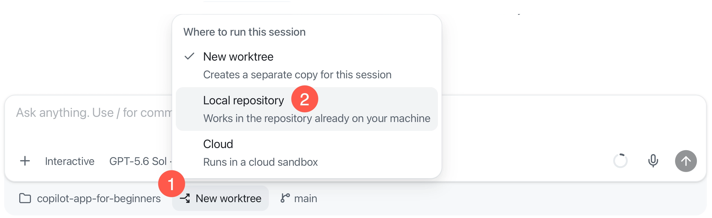

## Learning Objectives

By the end of this chapter, you'll be able to:

- Install and set up the GitHub Copilot app
- Connect the repository to an agent session

Once the app can see the repository, Chapter 01 explains why you'd use the app and starts the real hands-on path.

> ⏱️ **Estimated Time**: ~20 minutes

## Prerequisites

- A [GitHub account](https://github.com/signup)
- A [Copilot plan](https://github.com/features/copilot/plans), or you can opt to continue with your own model provider during sign-in
    - For Copilot Business or Enterprise, the **GitHub Copilot app** policy must be enabled.
- [Git](https://git-scm.com/install) installed on your machine
- [Node.js LTS](https://nodejs.org) to run `samples/book-app-web` for the hands-on exercises
- [GitHub CLI (`gh`)](https://cli.github.com) for the initial one-time setup script used in the course

You will check the tool versions in the Copilot app's **Terminal** tab after connecting your repository.

## Installation

1. [Download and install the GitHub Copilot app][app-install] for your operating system.
2. Open the app and select **Sign in to GitHub**.
3. Sign in with your GitHub account.

    

4. At **Connect your repositories**, continue without adding a repository. You will connect your fork in the next section.
5. Pick a theme and select **Finish**.

    

The app opens the **New** page. Next, connect your copy of the course repository.


## Connect to your repository

> [!NOTE]
> If the Copilot app reports that Git is missing when you connect your repository, [install Git](https://git-scm.com/install), then retry the connection.

1. [Fork the course repository on GitHub][fork-repo-link]. A fork is your own copy of the repository on GitHub.

2. In the Copilot app, select **+** next to **Projects**, then select **Add GitHub repository**.

    

3. Search for `copilot-app-for-beginners` and select your fork. The app downloads a local copy (clones it) and adds the project to the sidebar.

<details>
<summary>Other ways to connect a repository</summary>

Select **+** next to **Projects**, then choose the option that matches what you have:

| If you have... | Select |
|---|---|
| A local copy of your fork | **Open folder**, then select the folder |
| Your fork's repository URL | **Clone repository**, then paste the URL |

</details>

## Check your tools in Terminal

> [!NOTE]
> Use the GitHub Copilot app's **Terminal** tab to run commands. Use the prompt box to send requests to the agent. In [Chapter 03](../03-development-workflows/README.md#confirm-the-sample-app-is-ready), you will use Terminal again to run tests, build the sample app, and start its development server.

1. Confirm that the sidebar shows `copilot-app-for-beginners` under **Projects**.

1. Select **+** next to the `copilot-app-for-beginners` project to start a project session.

1. Select the workspace selector below the prompt box, then choose **Local repository** instead of **New worktree**.

    This uses the clone already on your machine for setup. You will learn about worktrees in Chapter 02.

    

1. Select **View** > **Toggle Review Panel** to open the side panel if it is not already visible.

1. Select the **Terminal** tab. If it is not visible, select **+**, then **Terminal**.

1. In **Terminal**, run these version checks to ensure that the prerequisites are installed correctly.

    ```bash
    git --version
    node -v
    npm -v
    gh --version
    ```

    Each command should display a version number.

    Install only the tools that are missing, using the links in [Prerequisites](#prerequisites), then run the checks again.

1. The setup script uses GitHub CLI, which has a separate sign-in. Confirm that it uses the account you used to create your fork:

    ```bash
    gh auth status
    ```

    If you are not signed in to that account, run:

    ```bash
    gh auth login
    ```

    Select **GitHub.com**, then **Login with a web browser**. After sign-in, run `gh auth status` again and confirm the active account before you continue.

<a id="seed-the-repository"></a>

## Add the course practice items

The setup script prepares your fork with the practice items used in later chapters:

- **Labels** to organize the course tasks.
- **Issues** describing bugs and improvements you'll work on.
- **Practice branches** with separate versions of the Book App, including intentional bugs to fix.
- **Pull requests** with changes to review, a feedback comment to address, and an intentionally failing automated check.

These are training scenarios, not problems with your setup. The intentional bugs stay on practice branches, not `main`. The script creates items on GitHub in your fork, so you'll preview its target and planned changes before running it.

1. Open the **Actions** tab in your fork on GitHub.com. New forks disable workflows by default. If you see **Workflows aren't being run on this forked repository**, select **I understand my workflows, go ahead and enable them**.

    Enable workflows so GitHub can run automated checks for the practice exercises.

1. Return to the same **Terminal** tab in the Copilot app. Run this command from the repository root, the folder containing `.github` and `samples`, to preview the setup without creating practice items:

    ```bash
    node .github/scripts/setup-training-scenarios.js --dry-run
    ```

    Wait for the preview to finish. Confirm that the `Repository:` line in the output shows your fork before you continue.

1. In the same **Terminal** tab, run the setup script:

    ```bash
    node .github/scripts/setup-training-scenarios.js --yes
    ```

    Wait for the terminal to show `Setup complete.`

### Checklist

After setup, you should have:

- [ ] A fork connected to the Copilot app
- [ ] [Course labels](../appendices/training-github-scenarios.md#manual-fallback-create-the-labels)
- [ ] [Training issues](../appendices/training-github-scenarios.md#manual-fallback-create-the-seeded-issues)
- [ ] [Practice branches](../appendices/training-github-scenarios.md#manual-fallback-create-practice-branches)
- [ ] [Training pull requests](../appendices/training-github-scenarios.md#manual-fallback-create-pull-request-scenarios)

### Your first prompt

Return to the prompt box in the project session. Submit this request to the Copilot app, not to Terminal:

```text
Give me an overview of the copilot-app-for-beginners course repository. Focus on the learning path and the samples/book-app-web folder.
```

**Expected Output:** The Copilot app should summarize the course structure and identify `samples/book-app-web` as the web sample used for later exercises.

---

## Troubleshooting


<details>
<summary>Setup and access problems</summary>

### I Cannot Sign In

Check:

- You're using the expected GitHub account
- You have a Copilot plan, or you continued with your own model provider
- Your organization left the **GitHub Copilot app** policy enabled (separate from the Copilot CLI policy)
- If your organization uses `*.ghe.com`, you selected **Sign in to GitHub Enterprise Cloud**

### I Cannot See the Repository

Check:

- You've got access to the repository on GitHub
- You selected the correct account or organization
- You tried **Open folder** if the repository is already cloned

### A Chat Cannot Explain the Repository

Check:

- The correct repository is connected
- The prompt mentions `copilot-app-for-beginners`
- The app has permission to read the project folder

### The Script Stops for an Organization Fork

The script stops before changing a repository owned by an organization. Use this command only if you are authorized to set up that organization fork and have confirmed that the `Repository:` line shows the correct target:

```bash
node .github/scripts/setup-training-scenarios.js --yes --allow-shared-repository
```

### Practice Items Were Not Created

If issues are missing, open your fork on GitHub.com. Under **Settings** > **Features**, enable **Issues**, then rerun the script.

If you cannot run the script, complete the [manual setup steps in the Training GitHub Scenarios appendix](../appendices/training-github-scenarios.md#manual-fallback-create-the-labels) before Chapter 02.

</details>

---

## Key Takeaways

1. The GitHub Copilot app is a desktop control center for agent-driven coding work.
2. This course uses `samples/book-app-web` as the main sample app path.
3. Run the setup script so later chapters have practice branches, issues, and pull request scenarios ready.

## What's Next

### The Course Theme: Working in a Recording Studio

Throughout this course, we'll use a recording studio as a recurring analogy for working with the GitHub Copilot app. Each chapter will connect a part of agent-driven development to the familiar process of preparing, recording, reviewing and refining a track.

Before you record anything, you get the studio ready. You sign in for access, plug in your gear, load the song you'll work on and run a quick soundcheck before you commit a single take.


The setup you just completed is the software equivalent of preparing that studio.

In the next chapter, you'll answer a practical question first: why use the GitHub Copilot app if you already use GitHub Copilot in an editor or terminal? Then you'll tour the interface and learn about the different session types and modes.

**[← Back to course README](../README.md)** | **[Continue to Chapter 01 →](../01-tour-the-app/README.md)**

[fork-repo-link]: https://github.com/github/copilot-app-for-beginners/fork
[app-install]: https://github.com/features/ai/github-app
