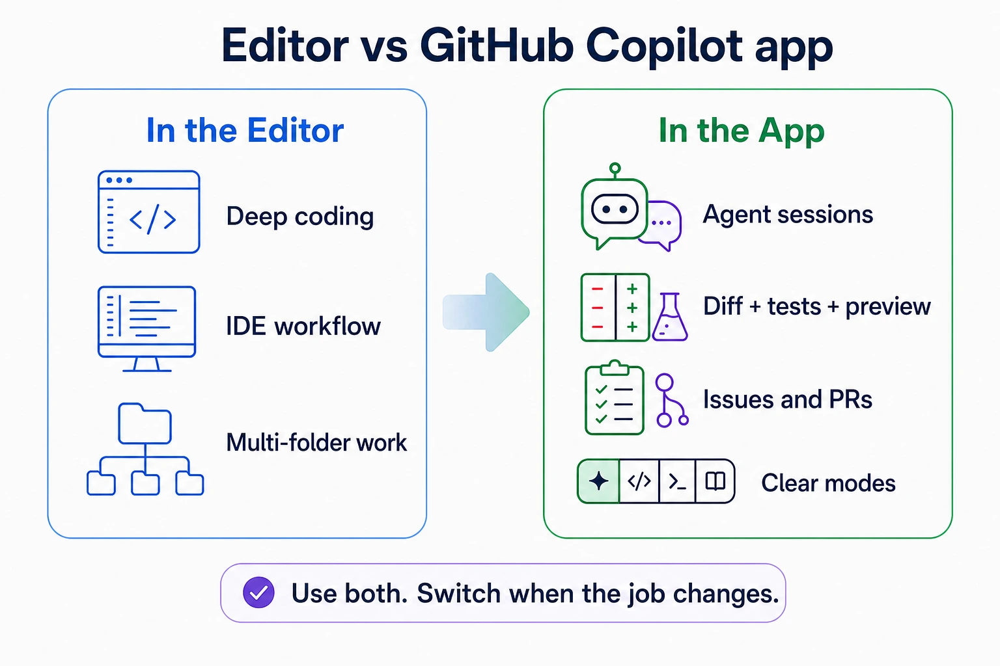
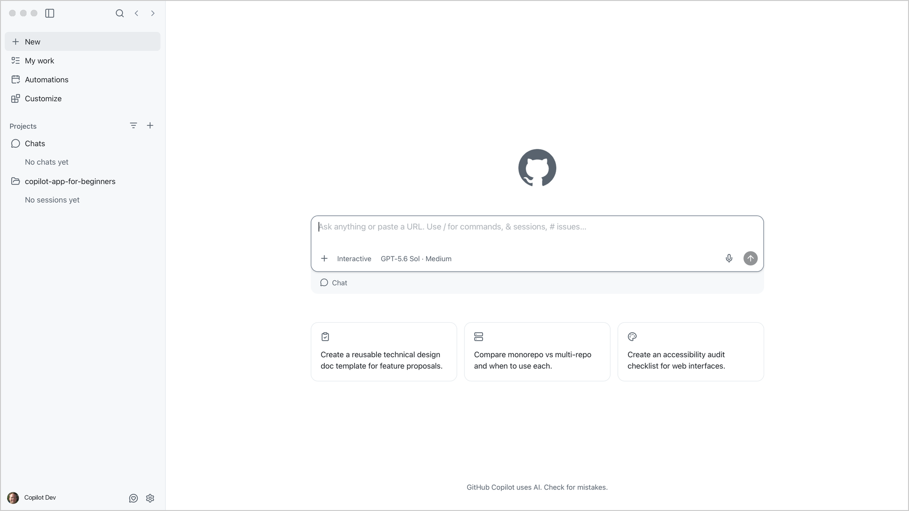
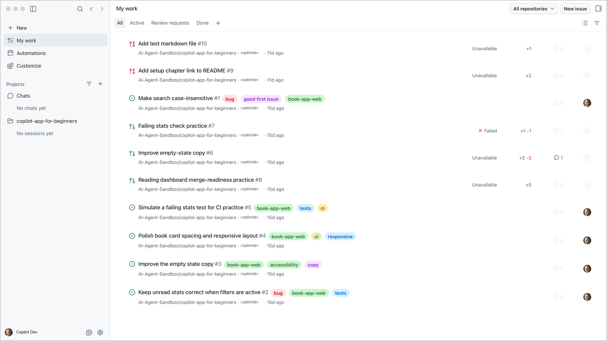
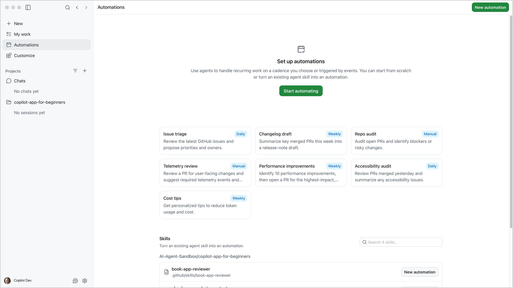
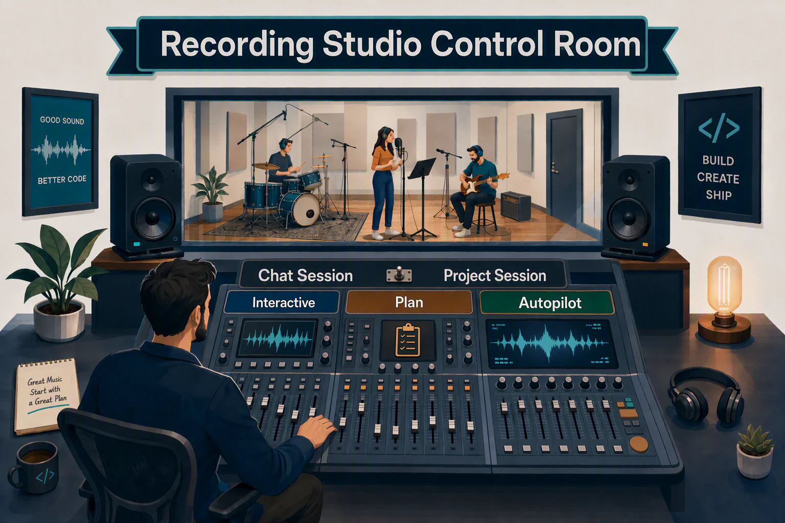
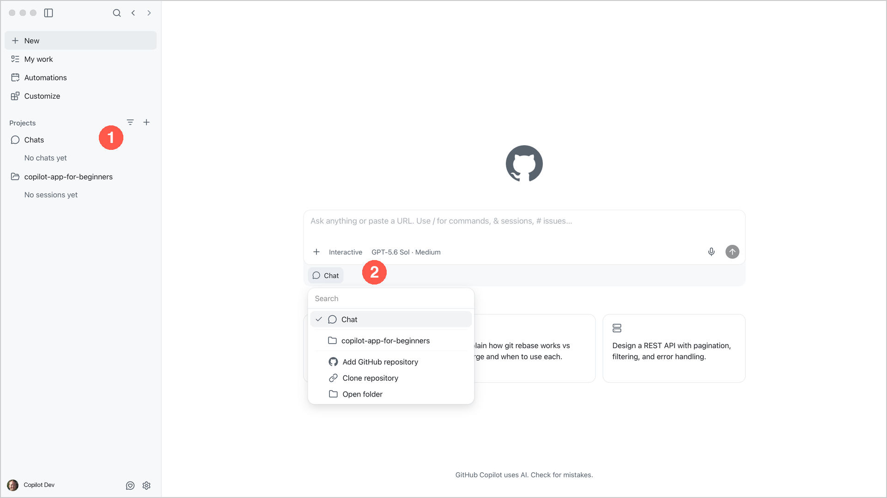
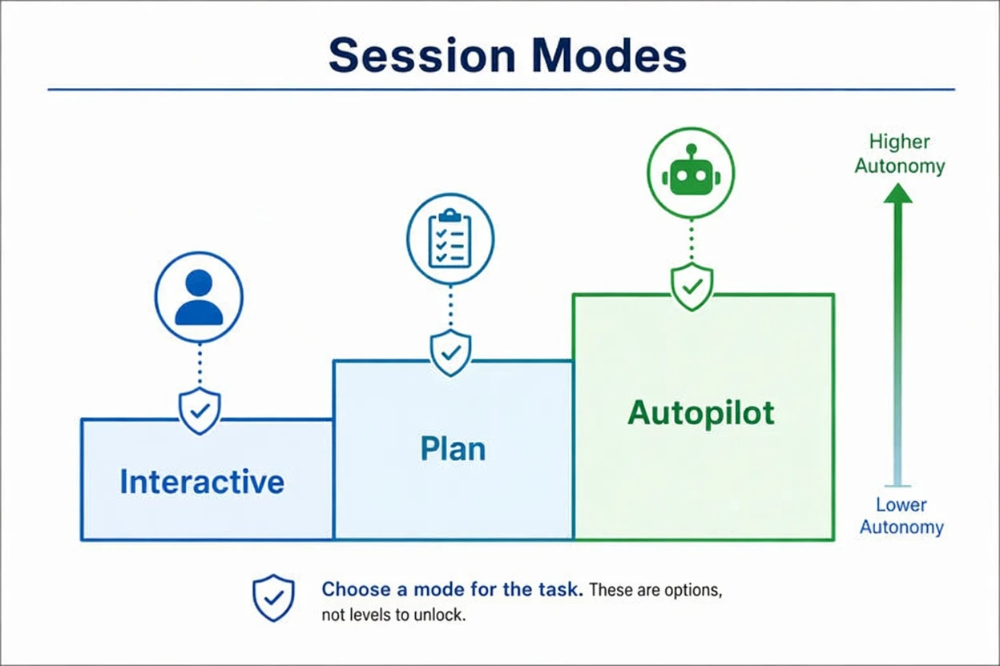
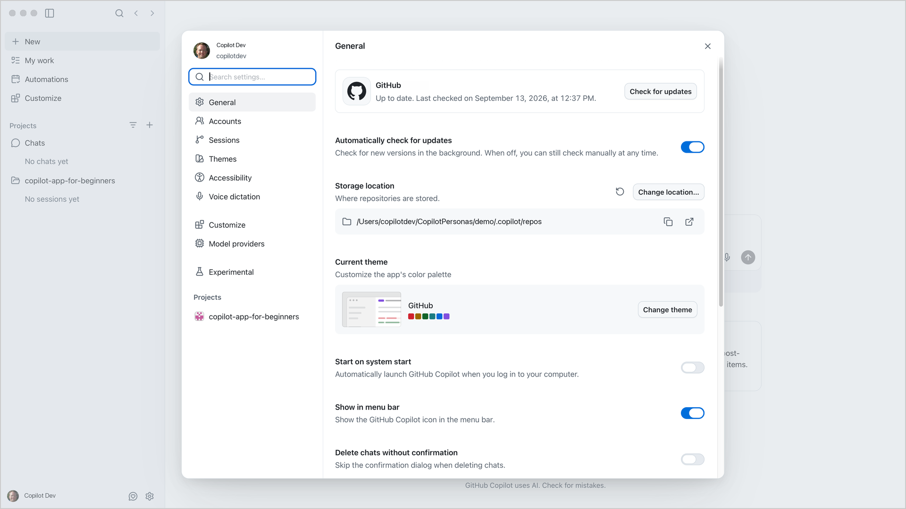

> **What if you could move from first prompt to pull request without manually piecing together context across multiple tools?**

Now that the app is installed and connected to the course repository, this chapter answers why the desktop app helps if you already use GitHub Copilot in an editor or terminal. Then you'll tour the main navigation, compare chats with project sessions, and see how session modes change how much control you have.

## Learning Objectives

By the end of this chapter, you'll be able to:

- Explain why you should use the GitHub Copilot app compared to using Copilot in an editor or Copilot CLI in the terminal
- Identify key app features and settings
- Explain the session modes: Interactive, Plan and Autopilot
- Select a model and reasoning effort based on task complexity
- Optionally try voice dictation

> ⏱️ **Estimated Time**: ~30 minutes

## Prerequisites

If you jumped straight here, pause and complete [Chapter 00: Setup](../00-setup/README.md) to install the app and connect your repository.

## Why use the GitHub Copilot app?

If you already use GitHub Copilot in VS Code or use Copilot CLI in the terminal, why bother with a separate app?

### The challenge

GitHub Copilot in the editor or terminal is excellent next to the code you already have open. VS Code can also open multi-root workspaces when you need more than one folder. The harder part is supervising agent work end to end: planning, isolated edits, tests, previews, issues, and pull requests. You end up piecing the story together yourself and asking "where was I?"

| Challenge | What it feels like |
|---|---|
| Shared working copy | Two agent tasks touch the same folder and branch, and the changes blur together |
| Scattered evidence | Plan in chat, diff in the editor, tests in a terminal, PR in the browser |
| Explore versus change | A quick question and a real code change feel the same until files start changing |
| Repeat work | You retype the same prompt every week for PR summaries, checks or cleanup tasks |

### The solution

The GitHub Copilot app is designed to make that supervision loop easier. It is not a replacement for your editor, and it is not "multi-project support" by itself. Editors already handle multi-folder work. The app gives you a desktop place to run and review project sessions, keep task evidence together, and move work through GitHub without hunting across tools.

| Challenge | What the app adds |
|---|---|
| Shared working copy | Project sessions keep focused work separate (you'll learn about worktrees later) |
| Scattered evidence | Project sessions, diffs, terminal output, browser previews, and GitHub work in one desktop app |
| Explore versus change | Chats for safe questions; project sessions when you are ready to work in the repo |
| Repeat work | Automations save a prompt and run it on demand, on a schedule or from selected GitHub events |



You still keep your editor. The app makes it easy to open the project in VS Code when you want to read code, debug, or edit by hand:

- Stay in VS Code, JetBrains, or your usual editor for deep editing and the IDE workflow you already know
- Open the GitHub Copilot app when you want to run project sessions, pick a mode, review what changed, and move work through issues and pull requests
- Jump back to VS Code from the app any time you want the full editor on the same project
- Use Automations later for repeatable agent work you do not want to retype each time

## Tour the App

Open the GitHub Copilot app and notice these areas in the sidebar:

### New

This is the landing view. You can start a chat without a project, select a connected project for a project session, choose a mode and model, or start with one of the sample project ideas.



### My work

This is your GitHub inbox for issues, pull requests and review requests. You can start work on an item from this page. The practice issues and pull requests created during setup should appear here.



### Automations

The **Automations** page is where you create recurring agent tasks. The page shows templates that can run manually or on a daily or weekly cadence. Automations can also be triggered by events. You choose local or cloud execution when you configure an automation. We'll dive deeper into automations in a later lesson.



### Customize

This is where you manage the ways to extend the app: skills, Model Context Protocol (MCP) servers, plugins, and extensions. You don't need any of them yet. Chapter 04 covers skills and custom agents, Chapter 05 covers MCP servers and plugins, and Chapter 06 introduces canvases.

### Projects and chats

The sidebar groups agent interactions under **Projects**. You can use a **Chat session** or a **Project session**.

| Use this | When you're trying to... | Creates branch or worktree? |
|---|---|---|
| Chat session | Ask questions, brainstorm, summarize, orient yourself | No |
| Project session | Plan, inspect, edit, test, or create PR-ready work | Usually yes, depending on session settings |

### From the Studio: In the Control Room

A producer in the control room doesn't handle every song the same way. Some takes need close direction. Some need the arrangement charted out first. Some quick questions just need a fast answer.



The GitHub Copilot app works the same way:

### Chat sessions

> A chat is like asking a musician a quick question.

Chat sessions help you learn and brainstorm without starting a branch. They are useful for general questions before you choose a repository. Try it:

- Select the **+** next to **Chats** in the sidebar to start a new quick chat.
- Open the project picker below the prompt and confirm that **Chat** is selected.
   
- Keep **Chat** selected.
- Submit the prompt below:

   ```text
   In the GitHub Copilot app, explain when I should use a chat and when I should use a project session. Do not create or change files.
   ```

**Expected Output:** The app should explain that chats are useful for general questions and that project sessions provide repository context for code work. It should not create or change files.

No branch or worktree is created for this prompt. This makes chats useful for general technical questions and brainstorming.

### Project sessions

Use a project session when the agent needs repository context, needs to change code or must create an artifact such as a pull request. Project sessions use a **New worktree** by default. Separate worktrees let agents work at the same time without changing the same working copy. The Chapter 00 setup session is an intentional exception because you selected **Local repository** for the one-time setup.

Return to the project session you created in Chapter 00 and submit this prompt:

```text
I'm learning the copilot-app-for-beginners course. Give me a beginner-friendly tour of the samples/book-app-web sample before I begin the hands-on exercises. Explain what the app does, the technologies it uses, how its main files are organized, how data flows through it and what the tests cover. Refer to specific file paths and finish with a suggested reading order. Do not change any files.
```

**Expected Output:** The app should describe the sample's purpose, technologies, main files, data flow and tests. It should refer to paths under `samples/book-app-web` and leave the files unchanged.

> [!NOTE]
> The hands-on exercises throughout the rest of this course focus on `samples/book-app-web`. This tour gives you a mental model of the sample before you begin working with it.

### Modes

> - **Interactive mode** is like directing a take with frequent check-ins.
> - **Plan mode** is like charting the arrangement and approving it before the first take.
> - **Autopilot** is like giving a clearly defined task to a trusted system and letting it complete it with minimal intervention.



| Mode | How the app interprets it | Use case |
|---|---|---|
| Interactive | "Step-by-step collaboration" <br> Copilot works with you step by step | You'd like to be involved throughout the entire process |
| Plan | "Plan first, execute when ready" <br> Copilot creates a plan before executing | The initial approach and project details matter |
| Autopilot | "End-to-end execution without interruption" <br> Copilot works independently | Tasks that are well defined and have clear outcomes |

### Models and reasoning effort

The session mode controls how independently the agent works. The model and reasoning settings control how it processes your request.

| Control | What it changes |
|---|---|
| **Model** | The AI model that handles your request. Models differ in capabilities, speed, and usage cost. |
| **Reasoning effort** | How much reasoning a supported model uses to work through a task. Higher effort can help with complex problems, but can take longer. |

The model control is below the prompt box, next to the mode selector. It shows **Auto** or a model name. Open it to find **Model** and **Effort**. Some app versions show separate model and reasoning controls.

With **Auto**, the Copilot app chooses a model for your task. This is different from **Autopilot**, which controls how independently the agent works.

For a repository tour or a short explanation, keep **Auto** or the current model and its default reasoning effort. For a difficult bug or a change across several files, consider a model suited to complex coding and a higher effort level. Higher effort does not guarantee a correct answer.

You do not need a specific model for this course. Available models and effort levels vary. Some models do not offer an effort setting.

#### Try the controls

1. Keep the Chapter 00 project session open. Select **Interactive** mode below the prompt box.
2. Open the model control. If you choose a model yourself, use **Model** to view the choices and select one. For this exercise, you can keep **Auto** or your current model.
3. If **Effort** or a separate reasoning control is available, open it and review the levels. Keep the default for this simple question.
4. Submit this prompt:

    ```text
    In samples/book-app-web, explain how filterBooks searches book titles and authors. Does letter case affect the results? Refer to the relevant file. Do not change any files.
    ```

**Expected Output:** The Copilot app should explain that search matches titles and authors without depending on letter case. It should refer to `samples/book-app-web/src/App.tsx` and leave the files unchanged.

You can change the model and reasoning effort during a session without changing its mode.

### Settings



<details>
<summary>Settings reference: What each area controls</summary>

| Setting | What you can do |
|---|---|
| General | - Check for app updates <br> - View or change where repositories are stored <br> - Change the theme and other app preferences |
| Accounts | - View personal and enterprise account information <br> - Add another GitHub account |
| Sessions | - Manage sessions and chats <br> - Set the response style <br> - Set app-wide instructions <br> - Configure branch naming and session behavior |
| Themes | Select and customize the app theme |
| Accessibility | - Display zoom, keyboard shortcuts <br> - Notifications & Announcements |
| Voice dictation | - Microphone settings <br> - Keyboard shortcut setup for activation <br> - Transcription models |
| Customize | Manage app customization settings |
| Model providers | Configure custom models from other providers using your own API keys |
| Experimental | Try preview features that can change or be removed |

The **Model providers** setting connects the app to additional providers. It does not replace the model picker below the prompt box. You do not need to configure a provider for this exercise if a model is already available.

</details>

<details>
<summary>Optional: Voice dictation</summary>

Voice dictation turns speech into editable prompt text, which can save time and effort when creating prompts.

Go back to the GitHub Copilot app's **Settings** dialog. Select **Voice dictation**, set up your input device and complete the configuration steps.

> [!NOTE]
> Microphone permission is granted at the operating-system level. Follow your operating system prompts to allow the GitHub Copilot app to use the microphone.

1. Select **Microphone privacy**, **Open preferences** and ensure the GitHub Copilot app has the necessary permissions to use the microphone.
2. Select **Test mic** to verify that it is working correctly.
3. Note the keyboard shortcut for activating voice dictation.
4. Exit the **Settings** dialog and return to the main app window.
5. Create a new chat under **Chats** and test voice dictation by using the keyboard shortcut.

</details>

---

## Troubleshooting

If you are still stuck, see the [Troubleshooting Reference](../appendices/troubleshooting-reference.md).

<details>
<summary>First navigation problems</summary>

### I Cannot Find a Setting Shown in the Chapter

Settings can vary by app version, operating system, organization policy, and enabled features. Look for the closest matching category, then check the official docs if the screen still does not match.

### Voice Dictation Does Not Work

Check microphone permission, local transcription model download status, shortcut conflicts, and language support.

### A Mode or Model Option Is Missing

Check your plan, organization policy, project settings, and app version.

</details>

---

## Key Takeaways

1. Keep your editor for deep coding. Open the GitHub Copilot app when agent work needs a clearer place to run and review.
2. From the app, you can open the project in VS Code any time you want the full editor.
3. The app is organized around work surfaces: New for starting work, My work for GitHub items, Projects and chats, Automations, and Customize for extending the app.
4. **Chat sessions** are for exploration. **Project sessions** are for focused repository work. **Automations** are for repeatable agent runs.
5. **Interactive**, **Plan** and **Autopilot** change the level of autonomy.
6. Choose the model and reasoning effort below the prompt box. Keep the defaults for simple tasks; consider higher effort for complex work.

## What's Next

In the next chapter, you'll solve the "shared working copy" challenge from this chapter: isolated sessions with worktrees, plus focused context with `@`, `#`, and `/`.

**[← Back to Chapter 00](../00-setup/README.md)** | **[Continue to Chapter 02 →](../02-sessions-worktrees-context/README.md)**

---

## Source References

- [Getting started with the GitHub Copilot app][getting-started]
- [Working with agent sessions][agent-sessions]
- [Choosing a model and reasoning effort][model-selection]
- [GitHub Copilot app changelog][app-changelog]
- [Voice dictation in the GitHub Copilot app][voice-input]
- [AI models reference][ai-models]

[getting-started]: https://docs.github.com/en/copilot/how-tos/github-copilot-app/getting-started
[agent-sessions]: https://docs.github.com/en/copilot/how-tos/github-copilot-app/agent-sessions
[model-selection]: https://docs.github.com/en/copilot/how-tos/github-copilot-app/agent-sessions#choosing-a-model
[app-changelog]: https://github.com/github/app/blob/main/changelog.md
[voice-input]: https://docs.github.com/en/copilot/how-tos/github-copilot-app/agent-sessions#using-voice-dictation
[ai-models]: https://docs.github.com/en/copilot/reference/ai-models
