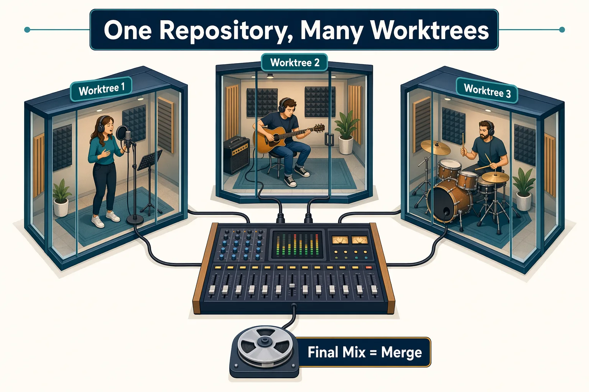
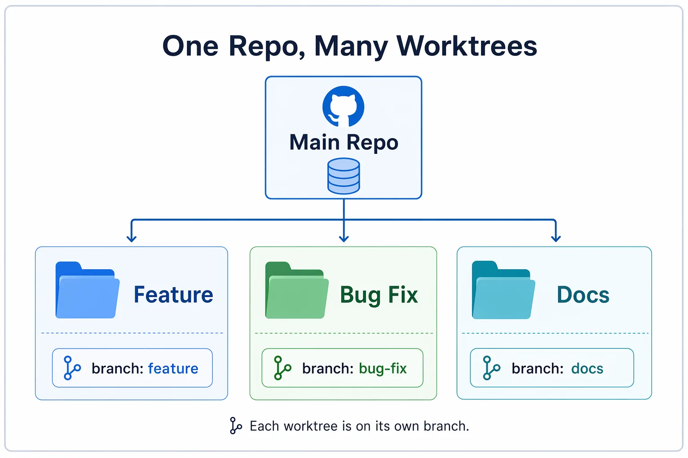
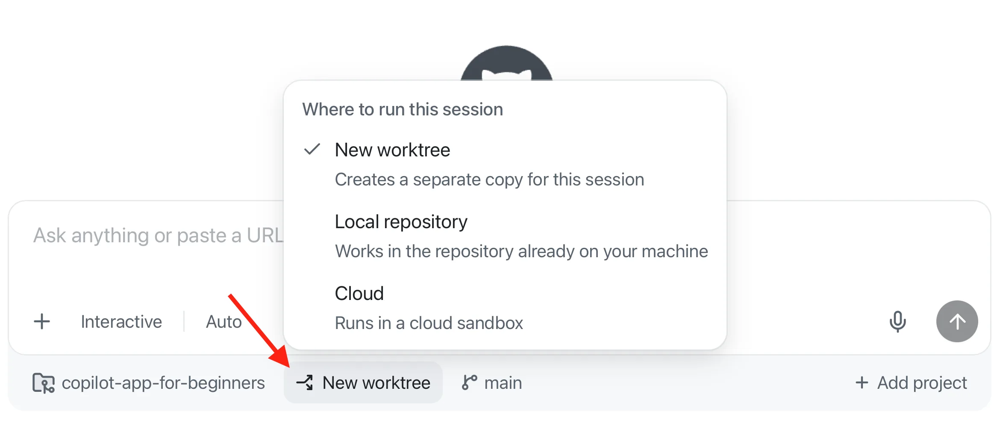
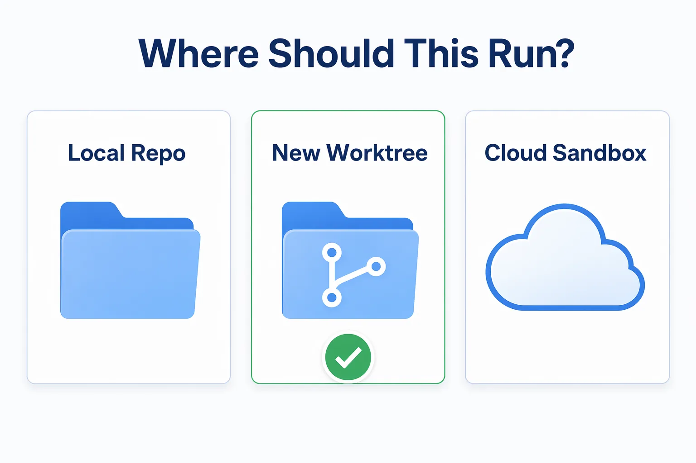
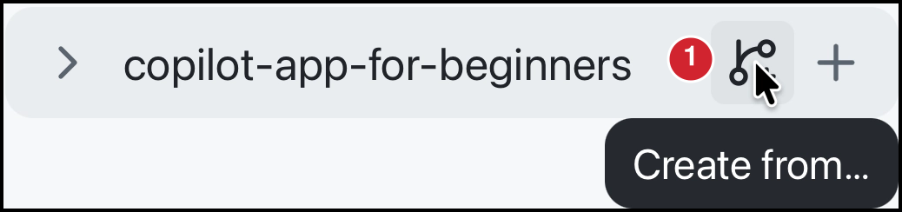
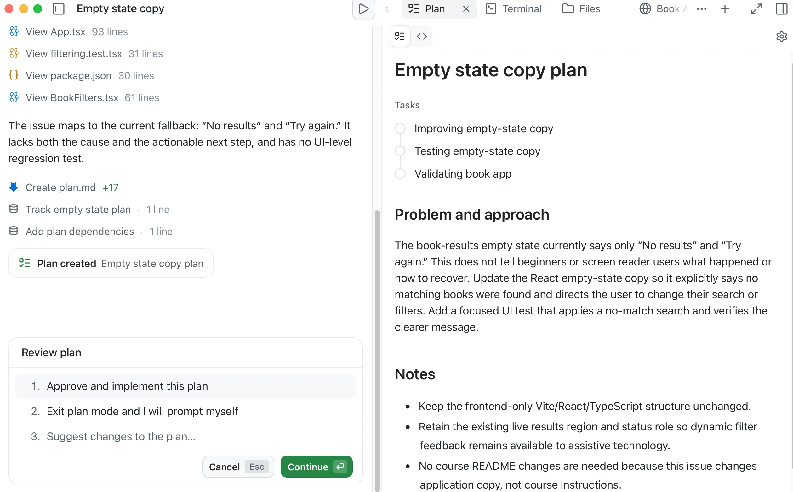
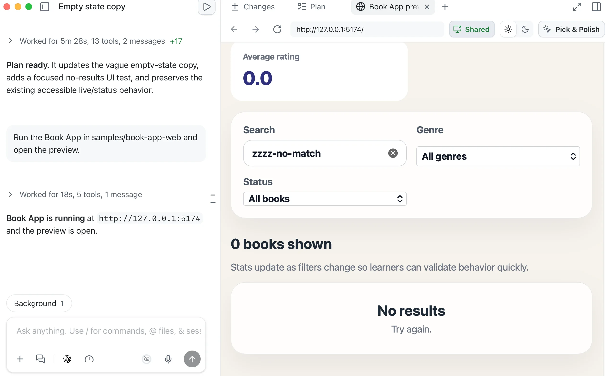
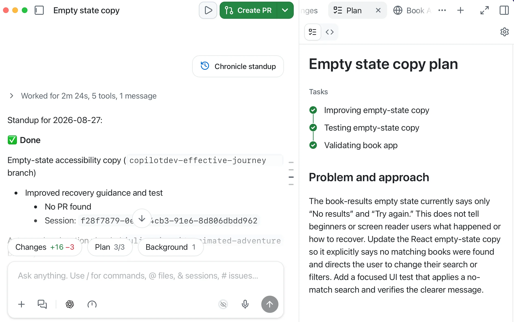
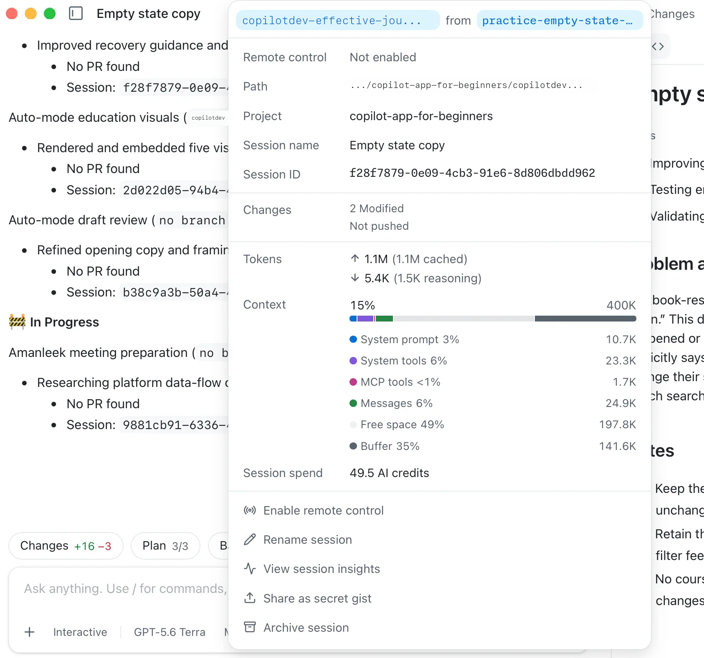

> **What if every task had its own workspace, branch, context and history?**

In Chapter 01 you saw the "shared working copy" problem: two agent tasks can blur together in one folder and branch. Sessions are where the GitHub Copilot app stops feeling like ordinary chat. A session can have its own branch, working folder, plan, diff, terminal output, browser preview, and GitHub context. In this chapter, you'll start a session from a task, learn how worktrees keep work separated, and practice giving GitHub Copilot proper context.

## Learning Objectives

By the end of this chapter, you'll be able to:

- Start a worktree-backed session from a branch and attach an issue as context
- Explain what a git worktree is and why you'd use it
- Understand why isolated sessions protect your main branch
- Add relevant context to a session so Copilot can understand the task and its supporting information
- Decide between working directly with a local repository, an isolated worktree, or a cloud sandbox

> ⏱️ **Estimated Time**: ~30 minutes

## Prerequisites

Complete Chapters [00](../00-setup/README.md) and [01](../01-tour-the-app/README.md). At this point, you've connected the course repository and understand the difference between chats and project sessions.

## From the Studio: One Studio, Many Recording Booths

Imagine one song that three musicians (vocalist, guitar, drums) need to record at the same time. To get the best results, you wouldn't crowd them around a single microphone and hope it works out. You'd put each one in their own soundproof booth to lay down a different part individually or possibly in parallel (to get more of that "live" feel), then mix the takes together later. This approach allows each recorded track to be edited and modified separately.



A worktree is like a separate recording booth. It's connected to the same repository (the same song), but it has its own folder and branch so parallel work doesn't collide.

## Core Concepts

### What Is a Git Worktree?

A **Git worktree** lets you create additional working directories for the same repository. Each worktree is usually checked out to a different branch (or commit).

This allows you to work on multiple tasks or branches simultaneously without stashing changes or constantly switching branches in a single folder.

### Why the GitHub Copilot app uses worktrees

| Without isolation | With a worktree-backed session |
|---|---|
| Multiple tasks can edit the same folder | Each task gets a separate folder |
| Easy to lose track of branch state | Session branch is visible in the app |
| Tests and diffs can mix together | Diffs stay tied to the session |
| Harder to compare work | Easier to inspect and approve |



### Running Multiple Sessions in Parallel

When each session uses its own worktree, you can work on several tasks without mixing their file changes: one session fixing a bug while another explores a different branch, each with its own folder and diff. This is the real payoff of worktrees. For this chapter, work through one session at a time.

### Where a Session Runs

When you start a session, the **Workspace** selector below the prompt box lets you choose *where* the work happens. 



The choices trade off speed against isolation:

| Workspace | What it means | Choose it when... |
|---|---|---|
| New worktree | The session gets its own folder and branch beside your clone | You want changes, branches, and diffs kept separate from your main checkout (the safe default this course uses) |
| Local repository | The session works directly in your existing clone, with no separate folder | You want a quick, low-stakes look and don't mind the session touching your working folder |
| Cloud | The session runs in a cloud sandbox on GitHub's hosted infrastructure instead of your machine | You want to offload the work or keep your local environment untouched |



> Tip: When in doubt, choose a new worktree. It keeps your `main` checkout clean while still running on your machine, which is why the rest of this course leans on worktree-backed sessions.

Worktrees separate **files and branches**. They do not separate everything on your machine. Dev servers, databases, and ports can still collide if two sessions use the same ones. When you run more than one app preview later, use different ports.

### Session Settings That Matter Here

Before you run multiple sessions, find the app's session settings you toured in Chapter 01:

| Setting | Why it matters |
|---|---|
| Branch prefix | Makes app-created session branches easier to recognize. Uses `%username%-` as the default prefix |
| App instructions | Settings → **Sessions** → **Instructions**. These apply to every session across projects |

### Context Syntax

The GitHub Copilot app lets you attach context in the prompt box with `@`, `#`, and `/`.

| Syntax | Use it for | Example |
|---|---|---|
| `@` | Files or folders | `@samples/book-app-web/src` |
| `#` | Issues or pull requests | `#12` |
| `/` | Slash commands | `/chronicle standup` |
| `&` | Other sessions, when the prompt box offers it | Type `&` and pick a session from the list |

> Tip: Provide the smallest amount of useful context. Less is often more.

### Slash Commands

Slash commands are shortcuts you type in the prompt box. They can open app utilities, invoke agent behaviors, inspect usage, or trigger installed skills. The safest way to discover what your app supports is to type `/` in the prompt box and read the palette. Commands can vary by app version, enabled plugins, installed skills, and organization policy.

For this chapter, you only need `/chronicle` and `/context`.

| Command | What it's for | Use it when... |
|---|---|---|
| `/chronicle` | Summarizes session history and past work | You want a session recap or standup-style summary |
| `/context` | Opens session context and token usage details when available | You want to see how much conversation and file text the session is holding |

<details>
<summary>Key GitHub Copilot app Slash Commands</summary>

| Command | Description |
|---|---|
| `/agent` | Select or switch the active agent for a session. |
| `/chronicle` | Summarize session history, generate standups, search past work, or get workflow/cost tips. |
| `/collect-debug-logs` | Collect app logs for troubleshooting or filing GitHub Copilot app issues. |
| `/context` | Show session context details such as token usage (how much text the model is holding), context window size, and AI credit spend. |
| `/create-canvas` | Create a canvas from the current session for a richer editable/inspectable surface. |
| `/orchestrate` | Coordinate multi-session or multi-repo work by delegating to child sessions. |
| `/remote` | Work with remote-session/remote-control flows when available in your build. |
| `/research` | Conduct research on a topic or question and summarize the findings. |
| `/review` | Request a review of the current session or a specific piece of code. |
| `/rubber-duck` | Ask a critic agent to review a plan, diff, tests, design, or proposed approach. |
| `/skills` | Discover available skills; `/skills reload` reloads skills during a session. |
| `/usage` | Open usage, rate-limit, plan-limit, or credit information. |
| `/[skill-name]` | Invoke an installed skill directly, such as `/security-review`; available commands depend on installed skills. |

When in doubt, type `/` and use the in-app palette to discover what's available.

</details>

## Exercise: Start a Session from an Issue

An **empty state** is the message shown when no books match your filters. You'll start a session from a practice branch where that message has intentionally been made less helpful, then attach the corresponding GitHub issue as context. Your forked repository already has the branch and issue if you ran the setup script in [00 - Setup](../00-setup/README.md).

Perform these steps:

1. In the sidebar, find the `copilot-app-for-beginners` project and select its **Create from** icon.

   

1. Select the **Branches** tab, then select `practice-empty-state-copy`. The app starts a new session from that branch in a new worktree.

1. In the session prompt box, set the **Mode** to **Plan**.

1. Type `#3`, then select **Improve the empty state copy** from the issue picker to attach it to the prompt. If your seeded issue has a different number, type `#` and select it by title.

1. Add the following instruction after the attached issue, then send the prompt:

   ```text
   Investigate the issue and create a plan to address it.
   ```

   Copilot should analyze the issue and generate a plan that you can review before making any changes. Notice that you can then approve and implement the plan using autopilot, exit plan mode and add your own prompts, or suggest changes to the plan.

   

1. Select `Exit plan mode and I will prompt myself` to exit plan mode and continue with your own prompts.

   Before making changes, run the Book App and observe its current behaviour so you have a baseline for comparison.

1. Submit this prompt:

   ```text
   Run the Book App in samples/book-app-web and open the preview.
   ```

1. The preview opens in the built-in browser panel. In the search bar on the book app, search for `hobbit` and confirm that **The Hobbit** appears.

1. Replace the search with `zzzz-no-match` to display the empty state. Note its current heading and message so you can compare them with the updated version later.

   

1. Ask the agent to implement the plan: `Implement the plan`

   As Copilot works, you'll see real-time updates in the plan checklist. The **Changes** tab shows the diff of the files being modified.

1. Select the **Changes** tab in the review panel or the **Changes** pill above the prompt box to inspect the diff.

1. Reload the browser tab and try the same search again. Confirm that the empty-state message suggests changing the search term, genre, or reading status.

## Slash Commands

Slash commands are shortcuts you run in the prompt box. Here you'll use:

- `/chronicle` to get a quick recap of what the session has done so far. Adding the `standup` argument formats that recap as a short, standup meeting-style summary.
- `/context` to check how much context the session is using, as well as inspect the branch and worktree the session is running in.

Perform these steps:

1. In the prompt box for the session you have been using, submit the following slash command:

   ```text
   /chronicle standup
   ```

   **Expected output:** Copilot should summarize what happened in the session and what decisions or changes were made.

   

1. Next, submit the following slash command to check the session, token, context, and worktree details:

   ```text
   /context
   ```

   In the session menu, select the **Context** bar to expand its breakdown.

   Context is the content the GitHub Copilot app is using for the current session. Checking it helps you know when a session is getting overloaded before you add more files, issues, or instructions.

   **Expected output:** The GitHub Copilot app opens the session menu and displays session, token, context, and usage information.

   

   - The session details show the working branch and base branch, **Path**, **Project**, **Session name**, **Session ID**, and **Changes**.
   - **Tokens** shows the session's input and output token totals.
   - Expanding **Context** shows how the context window is divided among the system prompt, system tools, messages, free space, and buffer.
   - **Session spend** shows the AI credits used by the session.

> [!NOTE]
> This practice branch contains an intentional regression. You don't need to create a pull request or merge the fix into `main`, because `main` already contains the correct behavior. Ask Copilot to stop this session's development server before continuing.

---

## Troubleshooting

If a session folder, branch, or preview looks wrong, start with [appendices/git-worktrees.md](../appendices/git-worktrees.md) and the [Troubleshooting Reference](../appendices/troubleshooting-reference.md).

<details>
<summary>Session, worktree, and context problems</summary>

### I don't see the practice branches

Run the Chapter 00 setup script again, or follow [appendices/training-github-scenarios.md](../appendices/training-github-scenarios.md). Confirm you connected your fork, not the upstream course repo.

### The session edited the wrong folder

Open the session details and check the worktree path and branch name. Prefer a **new worktree** for course exercises.

### `/context` or `/chronicle` is missing

Type `/` and use the in-app palette. The official list is in [Slash commands for the GitHub Copilot app](https://docs.github.com/en/copilot/reference/github-copilot-app-reference/slash-commands).

### Two previews collided

Worktrees isolate files and branches, not ports. Stop one Vite server or start the second on port `5174`.

</details>

---

## Key Takeaways

1. Sessions are focused agent workspaces.
2. Worktrees keep session changes separate from your main checkout.
3. The workspace selector lets a session run in your local clone, a new worktree, or a cloud sandbox; a new worktree is the safe default.
4. Worktrees isolate files and branches, but not ports, databases, or background processes.
5. Run parallel sessions on different ports to avoid collisions.
6. `@`, `#`, and `/` help you control context and commands.
7. Slash commands can be used to quickly access features and information within the app.

---

## Assignment


Use the workflow from this chapter to add a light and dark theme to the Book App in an isolated worktree. The earlier exercise used `#` to attach an issue; this time, use `@` to attach the code the agent needs. Keep the work local. Chapter 03 covers the issue and pull request workflow.

1. In the sidebar, select **Create from** for the `copilot-app-for-beginners` project and start a new worktree session from `main`.

1. Submit `/context` and inspect the session details. Confirm that the working branch is separate from `main` and note the worktree path.

1. Ask Copilot to run `samples/book-app-web` and open the preview.

1. Inspect the app and confirm that it only supports a light theme.

1. Set the session to **Plan** mode. Type `@samples/book-app-web/src`, select the folder from the picker, and include the following request:

   ```text
   Plan a light and dark theme toggle for the Book App using the attached source folder.

   - The user can switch between light and dark themes.
   - The toggle has a clear, accessible label.
   - Text, controls, cards, and backgrounds remain readable in both themes.
   - Search, filters, and reading statistics keep their current behavior.

   Name the files you expect to change and the checks that will show the feature works. Keep the plan small. Do not change any files yet.
   ```

1. Review the plan, select **Exit plan mode and I will prompt myself**, then ask Copilot to implement it.

1. Inspect the diff and confirm that it only contains changes needed for the theme toggle. Reload the browser preview and verify that the toggle switches between readable light and dark themes. Try `hobbit` and `zzzz-no-match` in both themes to check the book cards and empty state.

1. Ask Copilot to run the relevant tests and build. Inspect the command output before treating the change as complete. Chapter 03 explains these validation steps in more detail.

1. Submit `/chronicle standup`. Compare the recap with the diff and checks you observed. It should distinguish completed work from anything still needing attention.

1. Ask Copilot to stop this session's development server. The theme feature remains in its worktree and isn't added to `main`. You don't need to create an issue or pull request for this assignment.

**Success criteria:** You can identify the session's branch and worktree, explain which context you attached, and show the theme change and its validation evidence without changing `main`.

## What's Next

In the next chapter, you'll use isolated sessions for real development work. The inner loop covers review, debug, test, and browser preview. The outer loop covers My work, issues, pull requests, review comments, and checks.

**[← Back to Chapter 01](../01-tour-the-app/README.md)** | **[Continue to Chapter 03 →](../03-development-workflows/README.md)**

---

## Source References

- [About the GitHub Copilot app][about-app]
- [Working with agent sessions][agent-sessions]
- [Slash commands for the GitHub Copilot app][slash-commands]
- [GitHub Copilot app repository][app-readme]
- [GitHub Copilot app changelog][changelog]
- [GitHub Copilot app product blog][app-blog]

[agent-sessions]: https://docs.github.com/en/copilot/how-tos/github-copilot-app/agent-sessions
[slash-commands]: https://docs.github.com/en/copilot/reference/github-copilot-app-reference/slash-commands
[about-app]: https://docs.github.com/en/copilot/concepts/agents/github-copilot-app
[app-readme]: https://github.com/github/app
[changelog]: https://github.blog/changelog/2026-06-17-github-copilot-app-generally-available/
[app-blog]: https://github.blog/news-insights/product-news/github-copilot-app-the-agent-native-desktop-experience/
