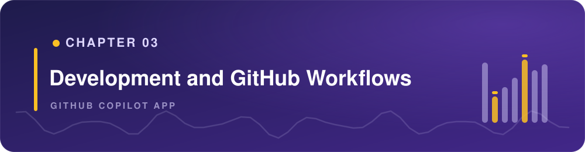

> **What if one supervised workflow carried a change from the first edit to a merge-ready pull request?**

The previous chapters introduced the app, project sessions, worktrees, and context. This chapter puts them together as two connected loops:

- The **inner loop** happens on your machine: understand the task, change the code, inspect the diff, run tests, and preview the result.
- The **outer loop** happens on GitHub: start from an issue, open a pull request, respond to review feedback, and confirm checks pass.

The GitHub Copilot app connects both loops, but you remain responsible for reviewing the evidence and deciding what ships.

## Learning Objectives

By the end of this chapter, you'll be able to:

- Use the review panel, tests, build output, and browser preview to validate a local change
- Add a regression test and ask the rubber duck agent to critique your work
- Use **My work** to move from an issue to a pull request
- Ask GitHub Copilot to address review comments and failing checks
- Explain where human judgment fits in both loops

> ⏱️ **Estimated Time**: ~75 minutes

## Prerequisites

Complete Chapters [00](../00-setup/README.md), [01](../01-tour-the-app/README.md), and [02](../02-sessions-worktrees-context/README.md).

This chapter uses the practice branches, issues, and pull requests created by the [Chapter 00 setup script](../00-setup/README.md#seed-the-repository). If you skipped that step, run the script now. If you can't create pull requests, you can still read the outer-loop steps and follow the screenshots.

## From the Studio: From Take to Final Mix

A musician doesn't keep the first take just because it's finished. They record, listen, adjust, and record again. That's the **inner loop**: make a change, then inspect the evidence.

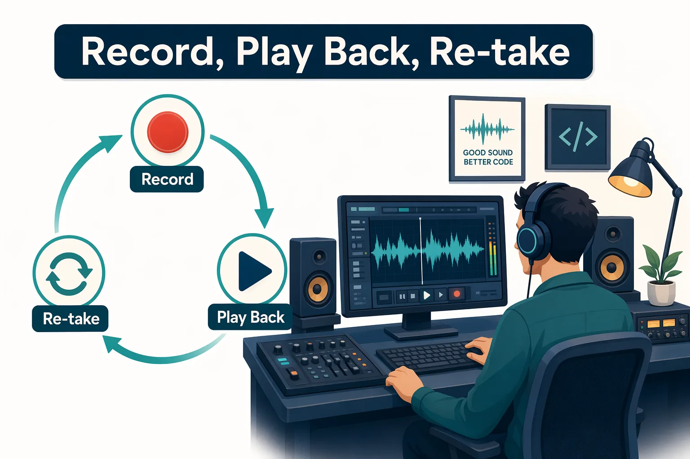

A finished take still needs to move through production. The producer tracks the brief, feedback, quality checks, and final approval. That's the **outer loop**: use issues and pull requests to move validated work through GitHub.

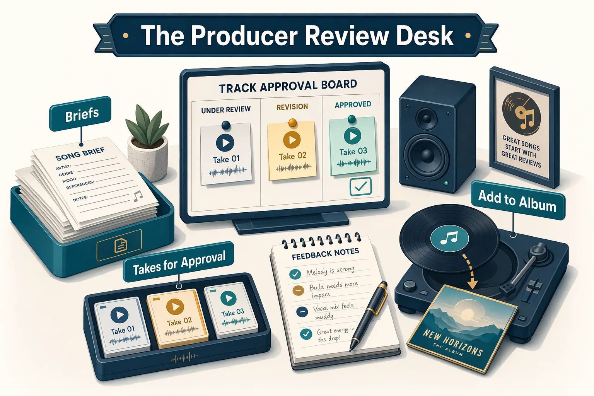

## Core Concept: Trust the Evidence

A confident response from Copilot isn't the same as validated software. Use these surfaces to decide whether a change is ready:

| Evidence | Where to find it | What to check |
|---|---|---|
| Diff | Review panel **Changes** tab | The change is focused and understandable |
| Tests and build | Review panel **Terminal** tab | The relevant tests and build complete successfully |
| Running app | Review panel **Browser** tab | The behavior works as expected |
| GitHub checks | Pull request in **My work** | Continuous integration (CI) agrees with your local results |

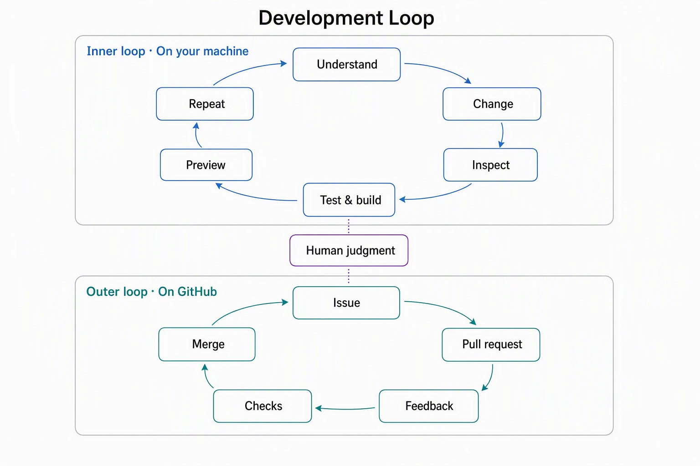

## Confirm the Sample App Is Ready

The repository includes `.github/copilot-instructions.md`, which gives Copilot project-specific guidance. It describes the sample app, its beginner-friendly conventions, and its validation commands.

<details>
<summary>Optional: How Copilot gets context</summary>

Copilot doesn't work from your prompt alone. It also uses settings, instructions, and repository files. More context isn't always better, so keep each layer focused.

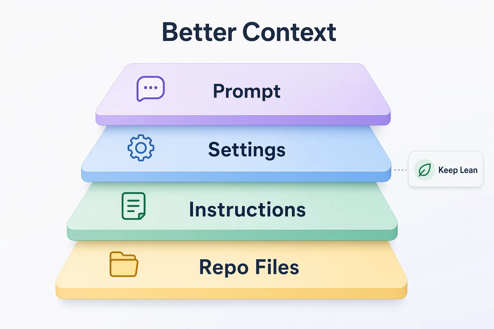

| Context layer | What it includes |
|---|---|
| Prompt | What you ask in the current turn, including files, folders, issues, or pull requests attached with `@` and `#` |
| Settings | Your app-wide session instructions and project-specific notes |
| Instructions | Shared repository guidance such as `.github/copilot-instructions.md` or `AGENTS.md` |
| Repo files | The code, tests, documentation, and other files Copilot can access |

Attach only the context that helps with the current task. Focused context makes it easier for Copilot to understand your goal and follow the repository's conventions.

</details>

1. Create a new session for the `copilot-app-for-beginners` project.
1. Set the mode to **Interactive**, then submit:

   ```text
   Summarize the @samples/book-app-web test framework and build tool that are used to validate changes. Include the commands to run tests and build the app.
   ```

1. Select **View** > **Toggle Review Panel**.
1. Select **Terminal**. If it isn't open, select **+**, then **Terminal**.

1. Run:

   ```bash
   cd samples/book-app-web
   npm install
   npm test -- --run
   ```

The **Terminal** should show four passing tests:

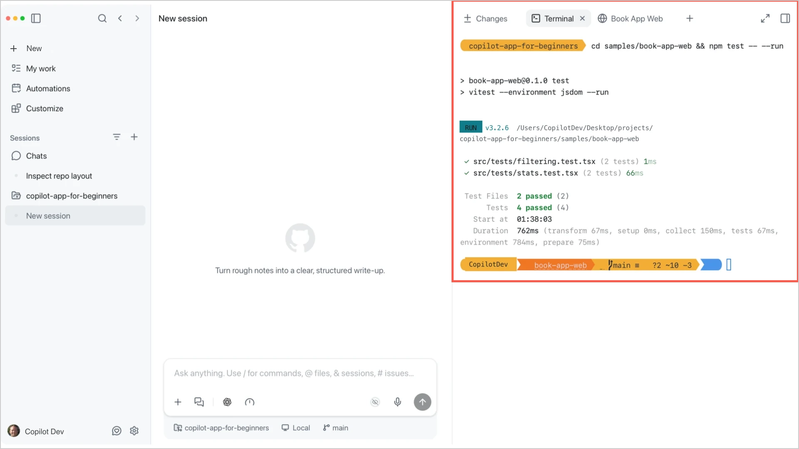

1. Run:

   ```bash
   npm run build
   ```

The tests and build should pass before you introduce any changes. This gives you a known-good baseline.

> [!NOTE]
> Each practice branch opens in a separate worktree. Run `npm install` the first time you use a new worktree because dependencies aren't shared automatically.

## Inner Loop: Develop and Validate on Your Machine

The inner loop is:

1. Understand the task.
2. Make a focused change.
3. Inspect the diff.
4. Run tests and the build.
5. Preview the behavior.
6. Repeat if the evidence reveals a problem.

### 1. Review and Fix a Bug

The `practice-unread-count-bug` branch contains a regression where reading statistics ignore active filters.

In Chapter 02, you attached an issue to practice giving Copilot focused context. Here you'll use that same skill as the starting point for a complete inner loop: plan the fix, change the code, inspect the diff, run the tests, and preview the result.

1. Select **Create from** next to the course project.
1. Choose **Branches**, then select `practice-unread-count-bug`. The app starts a session in a new worktree.
1. In the prompt box, type `#2`, then select **Keep unread stats correct when filters are active** to attach the seeded issue. If your issue has a different number, type `#` and select it by title.
1. Set the mode to **Plan**, add the following instruction after the attached issue, then submit:

   ```text
   Use the attached issue as the source of truth. Review @samples/book-app-web/src, identify the root cause, and create a short fix and validation plan.
   ```

1. Review the plan. It should connect the displayed statistics to the books currently shown after filters are applied.
1. Switch to **Interactive**, then submit:

   ```text
   Implement the plan. Keep the fix small, explain the root cause, and run the relevant tests.
   ```

1. Open the **Changes** tab and inspect the diff. Confirm that the change is focused on the filtered-book data flow. If it isn't, ask Copilot to revise it before continuing.

### Validate the Fix

1. Review the output in the session's **Terminal** tab. If Copilot already ran these commands after the fix, you don't need to run them again. Otherwise, run:

   ```bash
   cd samples/book-app-web
   npm install
   npm test -- --run
   npm run build
   ```

1. Start the development server:

   ```bash
   npm run dev
   ```

1. In the review panel, select **+**, then **Browser** (if it isn't already open). Enter the **Local** URL shown in the **Terminal** tab and press `Enter`.

1. Leave the search field empty, set the genre filter to **Fantasy**, and set the reading-status filter to **Unread**. Confirm that only **The Night Circus** appears and the unread count is **1**.

   With the original bug, the unread count stays at **5** because statistics use the full book list. Selecting **Unread** alone wouldn't reveal this problem: all five unread books would still be visible.

1. Return to **Terminal** and press `Ctrl+C` to stop the development server. This shortcut is Control+C on macOS, Windows, and Linux.

You've completed one inner-loop cycle: plan, change, inspect, test, build, and preview.

### 2. Add a Regression Test

A regression test proves the bug would fail before the fix and pass afterward.

1. Stay in the same **Interactive** session.
1. Submit:

   ```text
   Add or update a focused test that renders the Book App, selects Fantasy and Unread with an empty search field, and confirms that only The Night Circus appears and the displayed unread count is 1. The test should fail with the original bug and pass with the fix.
   ```

1. Inspect the test change in the **Changes** tab. Confirm that it checks the visible filtered results rather than weakening an existing expectation.
1. Run:

   ```bash
   npm test -- --run
   npm run build
   ```

Both commands should complete successfully.

<details>
<summary>Optional: Refactor Behind the Tests</summary>

The `filterBooks` function in `samples/book-app-web/src/App.tsx` combines several checks. With the tests passing, you can practice a behavior-preserving refactor:

```text
Refactor filterBooks in @samples/book-app-web/src/App.tsx to extract the search, genre, and status checks into small, clearly named helper functions. Keep its signature and behavior unchanged, then run the tests.
```

Inspect the diff and rerun the tests. If a test fails, adjust the implementation rather than changing the expected behavior.

</details>

### 3. Ask for a Second Opinion

The rubber duck agent acts as a constructive critic. It can identify missing evidence or assumptions before you open a pull request.

1. Stay in the session containing your fix and test.
1. Type `/` to open the slash-command palette, then submit:

   ```text
   /rubber-duck Critique this session's diff, tests, and browser validation. What should I double-check before creating a pull request?
   ```

1. Compare the critique with the evidence you gathered. Address any relevant gap before continuing.

> [!NOTE]
> The rubber duck agent is available when the main session uses a Claude or GPT model. If the command is unavailable, switch to one of those models or submit the same request without the slash command.

<details>
<summary>Optional: Use Pick &amp; Polish for a UI Change</summary>

**Pick & Polish** lets you select an element in the app's browser preview and attach it directly to your next prompt. Copilot receives the selected element as context, so you can ask for a focused UI change without describing where the element is in the code.

1. Start a new session from the `practice-card-polish` branch.
1. In the session's **Terminal** tab, run:

   ```bash
   cd samples/book-app-web
   npm install
   npm run build
   npm run dev
   ```

1. In the review panel, select **+**, then **Browser** (if it isn't already open). Enter the **Local** URL shown in the **Terminal** tab and press `Enter`.
1. In the browser toolbar, select **Pick & Polish**. This is step 1 in the following image.
1. Move your pointer over the app. Pick & Polish highlights elements as you move across the page.
1. Select the empty background area of one book card so the whole card is highlighted (step 2 in the image).
1. An `article.book-card` attachment appears in the prompt box (step 3 in the image), and Pick & Polish turns off.

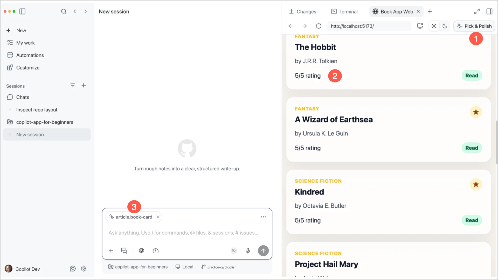

1. With the element still attached, submit:

   ```text
   Improve this book card's spacing and visual hierarchy while keeping the existing design and accessible text. Make the smallest useful change.
   ```

1. Preview the result. If you want another focused change, select **Pick & Polish** again, choose the element, and submit another short instruction.
1. Inspect the diff. Ask Copilot to revise or remove anything that isn't part of the focused card change.
1. Return to **Terminal** and press `Ctrl+C` to stop the development server, then run `npm test -- --run` and `npm run build`.

The attachment in the prompt box is the important part of this workflow. It shows that Copilot received context from the rendered page, not only from your written description. Visual changes can still affect behavior and accessibility, so finish with the same diff, test, build, and browser evidence as any other change.

</details>

## Outer Loop: Move the Work Through GitHub

The outer loop is:

1. Start from a GitHub issue.
2. Implement and validate the change in a session.
3. Review the diffs and evidence.
4. Open and review a pull request.
5. Respond to feedback and failing checks.
6. Merge only when the diff, local evidence, and GitHub checks agree.

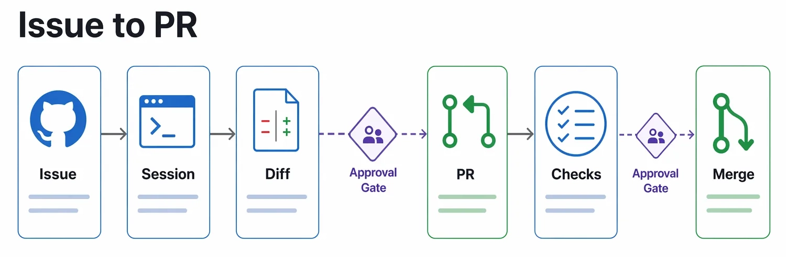

The diagram shows the main path toward a merge. Feedback or a failed check can send the work back to the session for another focused change and validation cycle.

### 4. Find Work in My work

**My work** is the app's inbox for issues, pull requests, review requests, and checks.

1. Open **My work** and stay on **All**.
1. Filter your fork by typing `repo:` in the search box, then select your repository:

   ```text
   repo:YOUR-OWNER/copilot-app-for-beginners
   ```

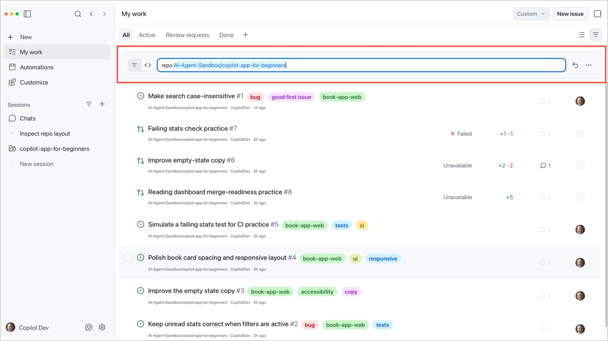

Alternatively, select **All repositories** at the top of **My work**, then select your repository from the list.

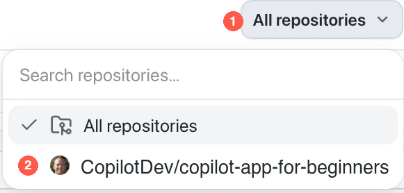

This view shows both issues and pull requests from the course repository. Add another qualifier when you want to narrow the list even further:

- Open issues:

  ```text
  repo:YOUR-OWNER/copilot-app-for-beginners is:issue is:open
  ```

- Open pull requests:

  ```text
  repo:YOUR-OWNER/copilot-app-for-beginners is:pr is:open
  ```

Confirm that opening an item shows its title, repository, number, and current status. If an expected item is missing, check the filter, repository access, and organization policy.

Replace `YOUR-OWNER` with the username or organization that owns your fork.

### 5. Start from an Issue and Open a Pull Request

Issue 1 asks you to make search in the book app case-insensitive. The intentional bug exists only on the `practice-search-case-bug` branch.

1. In **My work**, open the **Make search case-insensitive** issue and review the details. If needed, review the scenario in [`samples/app-course-issues.md`](../samples/app-course-issues.md#issue-1-make-search-case-insensitive).

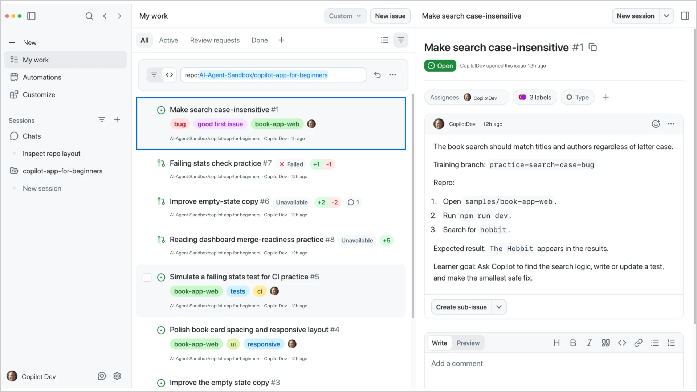

> [!NOTE]
> In a previous chapter, you attached an issue to a session with the `#<issue-number>` syntax. Here, you will attach the issue again and create a pull request from that session.

1. Select **Create from** next to the course project.
1. Choose **Branches**, then select `practice-search-case-bug`.
1. In the prompt box, type `#1`, then select **Make search case-insensitive** to attach the issue. If your issue has a different number, type `#` and select it by title.
1. Set the mode to **Plan**, add the following prompt after the attached issue, then submit:

   ```text
   Use the attached issue as the source of truth. Create a small implementation and validation plan. Name the files you expect to change and the tests or browser checks that should prove the fix. Don't edit files yet.
   ```

1. Review the plan, switch to **Interactive**, then submit:

   ```text
   Implement the plan. Include a focused regression test that proves uppercase and lowercase searches return the same result.
   ```

1. Follow the inner loop:
   - Inspect the diff in the **Changes** tab.
   - In **Terminal**, change to `samples/book-app-web` and run `npm install`.
   - Run `npm test -- --run` and `npm run build`.
   - Start the app with `npm run dev`.
   - Open a **Browser** tab and confirm that searches such as `hobbit` and `HOBBIT` return the same result.
   - Return to **Terminal** and press `Ctrl+C` to stop the development server.
1. Confirm that the **Changes** tab contains only the focused search fix and its test.
1. Ask Copilot for help with the description:

   ```text
   Draft a pull request summary for this session. Include what changed, why it changed, and the validation performed. Don't claim a check passed unless it appears in the terminal or CI output.
   ```

1. Review the draft, then select **Create PR** at the top of the session.
1. After the pull request is created, select it above the prompt box to view its details.
1. You can also view the pull request in **My work**.

Don't merge this practice pull request. The correct search behavior is already on `main`.

Your local evidence should show that the behavior works. The pull request now gives reviewers and CI a chance to check the same change on GitHub.

### 6. Address Review Comments and Failing Checks

The setup script created two separate pull requests for this exercise. They aren't the search-fix pull request you just opened.

Filter **My work** again:

```text
repo:YOUR-OWNER/copilot-app-for-beginners is:pr is:open
```

#### Respond to a Review Comment

1. Open the pull request titled **Improve empty-state copy**.
1. Find the conversation comment asking for more helpful guidance.

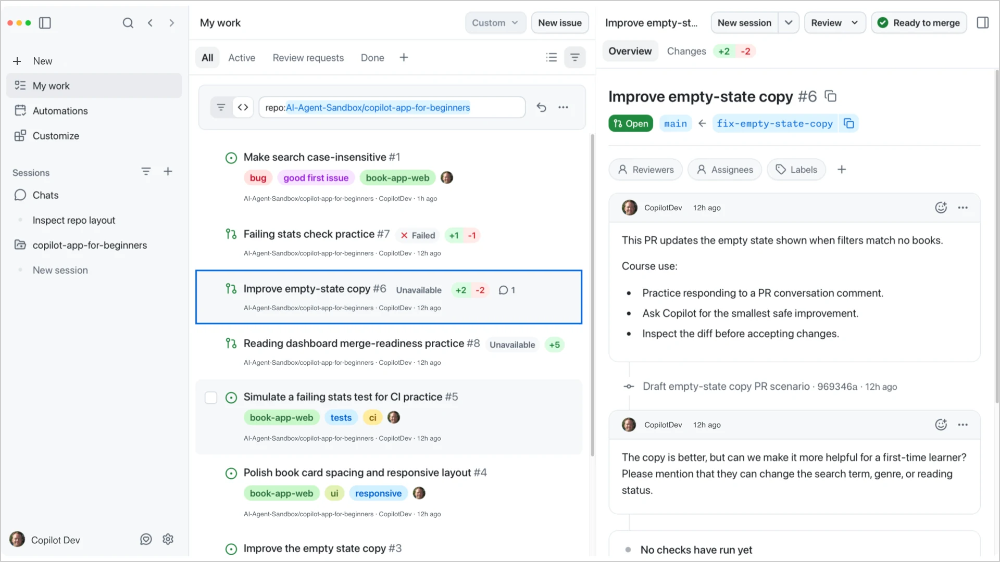

1. Select the checkbox next to the PR in **My work**.
1. At the bottom of the screen, select **Actions** followed by **New session** to start a session from the pull request.
1. Ask Copilot:

   ```text
   Address this PR conversation comment with the smallest useful change. Show me the diff and validation plan before I accept the fix.
   ```

1. Inspect the diff and confirm that the revised message addresses the complete comment.
1. Ask Copilot to commit and push the change, then return to the pull request and confirm the update.

#### Fix a Failing Check

A **CI check** is an automated validation run on a pull request, often through GitHub Actions.

1. Open the pull request titled **Failing stats check practice**.
1. Review the failed **Book app web** check.

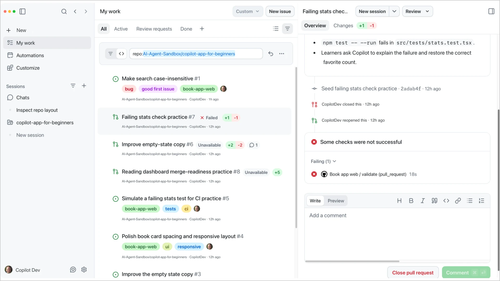

1. Select **Fix failing checks** if it's available. Otherwise, start a session from the pull request and submit:

   ```text
   Analyze the failing check. Explain the root cause, identify the likely file in samples/book-app-web, and propose the smallest fix. Don't weaken the failing test.
   ```

1. Confirm that the fix restores favorite counting for both read and unread favorites.
1. Validate locally:

   ```bash
   cd samples/book-app-web
   npm install
   npm test -- --run
   npm run build
   ```

1. Start the app with `npm run dev`, confirm the favorite count includes both read and unread favorites, then press `Ctrl+C` to stop the development server.
1. Inspect the final diff, then ask Copilot to commit and push the fix.
1. Return to the pull request and confirm that the **Book app web** check reruns successfully.

Don't mark a pull request ready until the diff is focused and the local and GitHub evidence agree.

<details>
<summary>Optional: Agent Merge</summary>

[Agent Merge](https://docs.github.com/copilot/how-tos/github-copilot-app/managing-issues-and-pull-requests#merging-a-pull-request) can help carry a pull request through review comments, checks, and merge requirements. You enable it from the merge-readiness control at the top of a pull request. It runs in the background, can continue after the app restarts, and merges only when GitHub allows it.

Although you won't use Agent Merge in this course, it may be appropriate when:

- The pull request is small and well scoped.
- You understand and reviewed the diff.
- Required checks are meaningful and passing.
- Review comments and repository merge rules are understood.
- Your organization allows the feature.

Don't use it for changes involving secrets, authentication, permissions, billing, production data, or deployment logic unless your team has explicitly approved that workflow.

Agent Merge is a finishing aid, not a replacement for human review.

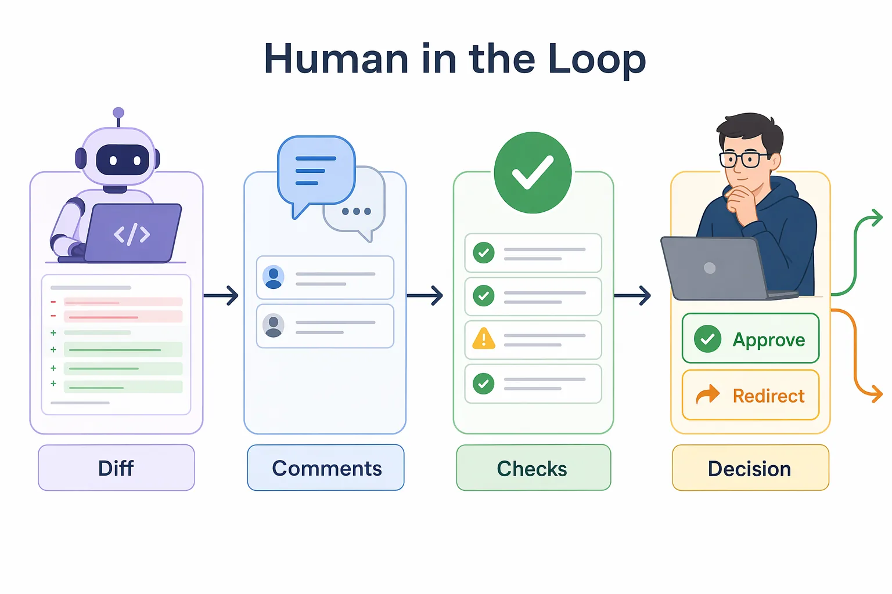

</details>

---

## Troubleshooting

If you're still stuck, see the [Troubleshooting Reference](../appendices/troubleshooting-reference.md).

<details>
<summary>Development and GitHub workflow problems</summary>

### Browser Preview Doesn't Update

Confirm that the development server is running in the current session's worktree and that the **Browser** tab is using the **Local** URL shown in the **Terminal** tab.

### Tests Fail Only in One Session

Confirm that dependencies are installed in that worktree and that the session is using the expected practice branch.

### I Can't See an Issue or Pull Request

Check the active **My work** filter, repository access, permissions, and organization policy.

### Local Results and CI Don't Agree

Compare the Node.js version, dependency installation, branch contents, environment variables, and generated files.

### A Pull Request Is Still Blocked

Confirm that required checks reran, review comments are resolved, and branch protection or merge rules aren't waiting for another approval.

</details>

---

## Key Takeaways

1. The inner loop happens on your machine: understand, change, inspect, test, build, and preview.
2. The outer loop happens on GitHub: issue, pull request, feedback, checks, and merge.
3. The review panel keeps the local diff, terminal output, and browser preview visible.
4. Tests protect behavior and make refactoring safer.
5. **My work** connects GitHub issues and pull requests to project sessions.
6. A change is ready only when the diff, local validation, GitHub checks, and human review agree.

## Assignment


Run both loops on a small UI task:

1. Choose a task:
   - If you skipped **Pick & Polish**, open Issue 4, **Polish book card spacing and responsive layout**, and start a session on the `practice-card-polish` branch.
   - If you completed it, start a new session from `main` and improve the filter-row labels or helper text instead.
1. Use **Plan** mode to define one small UI improvement, then switch to **Interactive** to implement it.
1. Inspect the diff and confirm that it stays focused on the selected UI area.
1. Run `npm test -- --run` and `npm run build`.
1. Preview the app at desktop and mobile widths.
1. Open a pull request with a summary that reports only the validation you performed.
1. Review the pull request in **My work** and confirm its checks pass.

## What's Next

In the next chapter, you'll reuse this workflow with a review skill and create a custom agent that explains the Book App without editing it. MCP servers and plugins follow in Chapter 05.

**[← Back to Chapter 02](../02-sessions-worktrees-context/README.md)** | **[Continue to Chapter 04 →](../04-skills-custom-agents/README.md)**

---

## Source References

- [Working with agent sessions][agent-sessions]
- [Managing issues and pull requests][issues-prs]
- [About the rubber duck agent][rubber-duck]
- [GitHub Copilot app changelog][app-changelog]
- [GitHub Copilot app product blog][app-blog]

[agent-sessions]: https://docs.github.com/en/copilot/how-tos/github-copilot-app/agent-sessions
[issues-prs]: https://docs.github.com/en/copilot/how-tos/github-copilot-app/managing-issues-and-pull-requests
[rubber-duck]: https://docs.github.com/en/copilot/concepts/agents/copilot-cli/rubber-duck
[app-changelog]: https://github.com/github/app/blob/main/changelog.md
[app-blog]: https://github.blog/news-insights/product-news/github-copilot-app-the-agent-native-desktop-experience/
