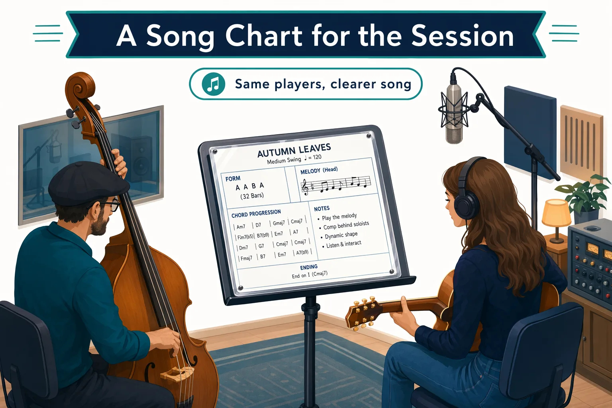
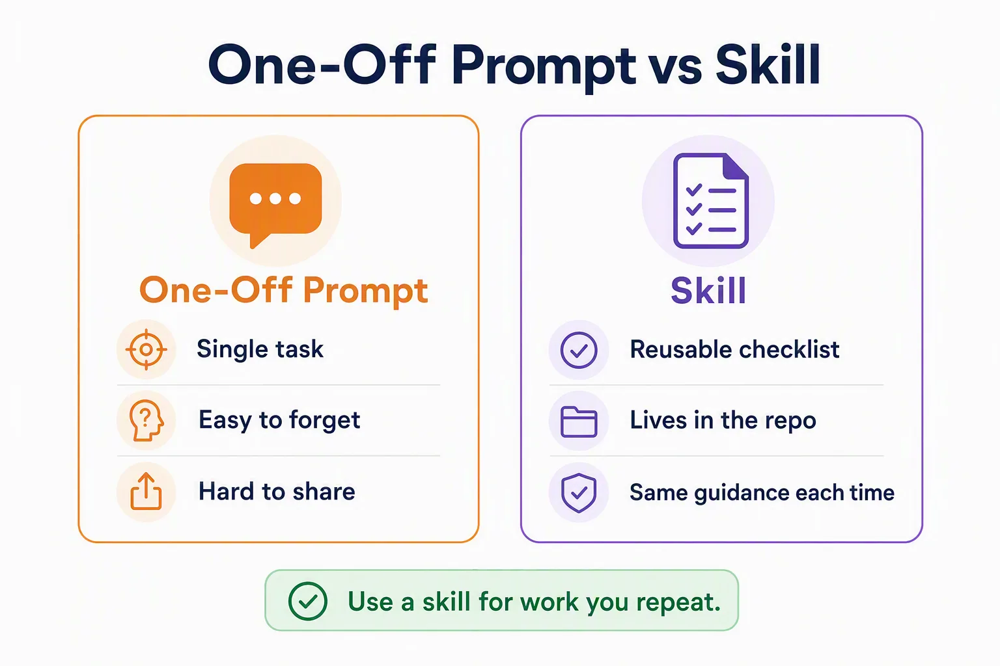
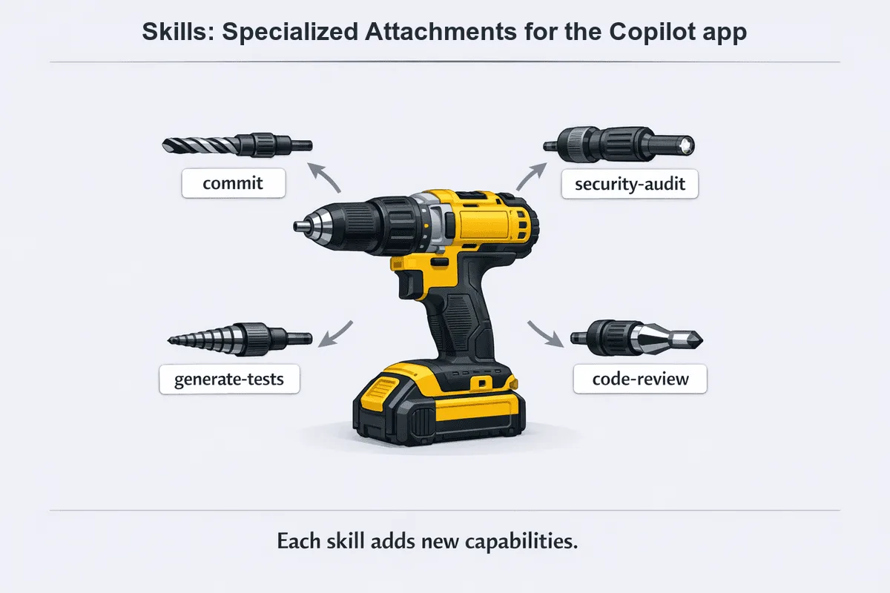
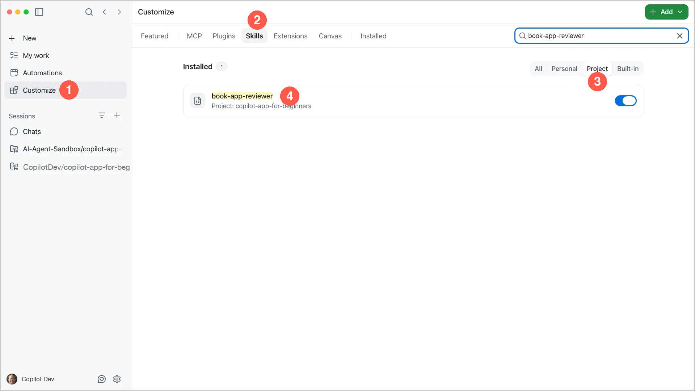
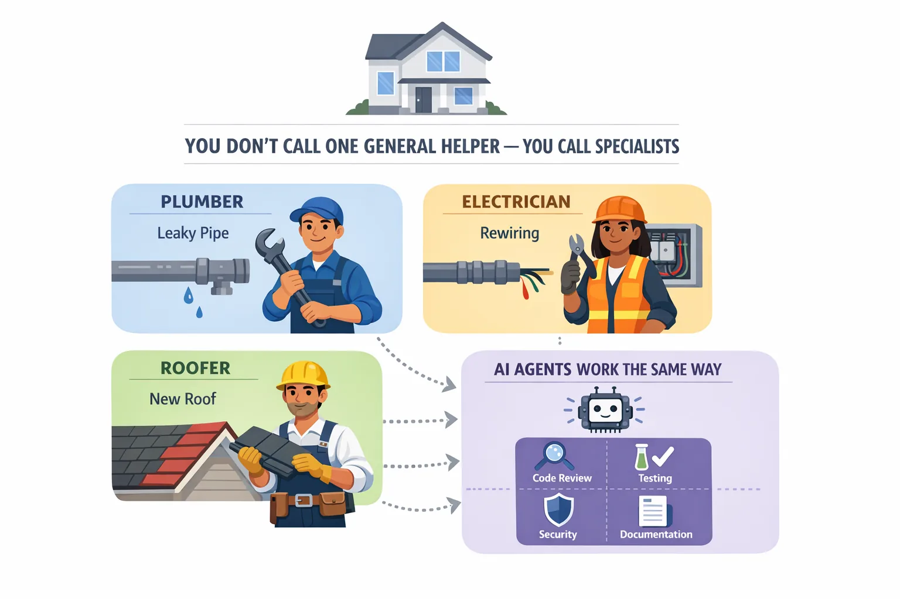
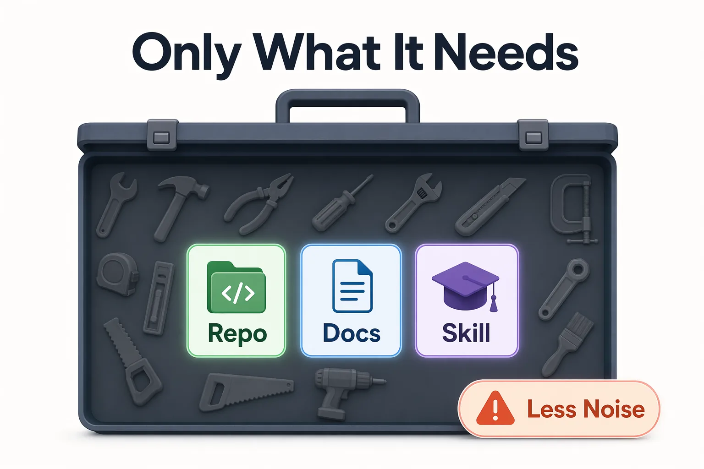

> **What if you could reuse your review checklist instead of typing the same reminders for each task?**

Chapter 03 connected a code change to its diff, tests, browser preview, and pull request. This chapter helps you reuse that workflow. You will start with a [skill](../GLOSSARY.md#skill) that stores review guidance for `samples/book-app-web`.

You'll also create a [custom agent](../GLOSSARY.md#custom-agent) that explains the sample without editing it. Skills supply reusable task instructions; custom agents define a role and its available tools. Chapter 05 covers connections to external tools and packaged capabilities.

## Learning Objectives

By the end of this chapter, you'll be able to:

- Choose between repository instructions, a skill, and a custom agent
- Find, update, and use the repository's `book-app-reviewer` skill
- Create and select a custom agent that can read and explain the sample without editing it
- Apply one skill-guided improvement and validate it with the Chapter 03 workflow

> ⏱️ **Estimated Time**: ~60 minutes

## Prerequisites

Complete [Chapter 03](../03-development-workflows/README.md). Use your course fork and the Node.js setup from Chapter 00. You do not need to merge any practice pull requests.

## From the Studio: A Song Chart for the Session

The players already know their instruments. The bandleader still hands out a chart so everyone plays *this* song the same way.



A skill is that chart. It gives the Copilot app instructions for a repeated task. A custom agent is the specialist who follows the chart, with a defined role and the tools needed for the job.

You still check the result. A chart does not guarantee a good performance.

## Core Concepts

### Choose the feature that fits the task

These features solve different problems. You don't need a custom agent for every skill or a skill for every prompt.

| Feature | What it adds | Example in this chapter |
| --- | --- | --- |
| Repository instructions | Shared rules for work across this project | Keep the Book App's stack and behavior unchanged |
| Skill | Instructions and resources for a repeated task | Update and apply a book-app review checklist |
| Custom agent | A named role with instructions and a selected set of tools | Create a read-only book-app explainer |

Find skills in the sidebar **Customize** tab. Select custom agents with `/agent` or the agent picker in the prompt box.

> [!TIP]
> **Optional exploration:** After you complete this chapter's exercises, browse the Awesome Copilot directories for examples of community-created [agents][awesome-agents] and [skills][awesome-skills]. Use `book-app-reviewer` and `book-app-explainer` for this chapter. Before you add or use another customization, review the agent's tools or the skill's instructions.

### Skill versus instructions versus a one-off prompt

The repository's `.github/copilot-instructions.md` file gives the Copilot app project-wide rules. A skill adds instructions for one kind of task.

| Guidance | Where it lives | When it applies | Best for |
| --- | --- | --- | --- |
| One-off prompt | The current conversation | When you send it | A single request |
| Repository instructions | `.github/copilot-instructions.md` | Across tasks in this project | The stack, file locations, and project rules |
| Skill | `.github/skills/<name>/SKILL.md` | When the task matches its description or you invoke it | A repeated workflow |



Instructions are the house rules. A skill is the chart for one kind of song.

> [!IMPORTANT]
> A skill tells Copilot how to approach a task, but its instructions do not enforce what Copilot is allowed to do. For example, a skill that says "review without editing" does not disable file-editing tools. Skills can also include scripts or tell Copilot to use tools, so read unfamiliar skills before enabling them. The course review skill contains instructions only.

## Create a Practice Session

1. Select **Create from** next to your course project.
2. Select **Branches**, then `main`, to start a session in a new worktree.
3. Set the mode to **Interactive**.
4. Submit the following prompt:

   ```text
   Show this session's branch and worktree path. Confirm that .github/skills/book-app-reviewer/SKILL.md and samples/book-app-web exist here. Do not edit files, commit, or push.
   ```

Keep this session for all the exercises. When you open a file in your editor, use the session's worktree, not the original clone.

**Expected Output:** The session shows a worktree path separate from your original clone and finds both paths.

> [!NOTE]
> File edits belong to this worktree. Installed tools can have a wider scope and affect other sessions. A new worktree from `main` will not contain uncommitted edits from this session.

## Skills: Save a Review Checklist

A drill can do different jobs with different attachments. Skills work in a similar way: they give the Copilot app reusable instructions for specific tasks. For the Book App, the `book-app-reviewer` skill supplies the review checklist.



The skill names in the graphic are examples. This exercise uses `book-app-reviewer`.

Start with the review skill you found in the practice session. A skill is a folder with a `SKILL.md` file. The course includes one at:

```text
.github/skills/book-app-reviewer/SKILL.md
```

The file starts with metadata between two `---` lines. This block is called **YAML frontmatter**. The `description` helps the Copilot app decide when to load the skill:

```markdown
---
name: book-app-reviewer
description: Review changes in samples/book-app-web for accessibility, responsive layout, tests/build validation, and small beginner-safe changes.
---
```

The Markdown below the frontmatter contains the instructions. This skill covers the stack, tests, build, accessibility, responsive layout, and change size.

Repository skills can be shared through Git. Personal skills apply across projects on your machine. See [About agent skills][agent-skills] for the supported locations.

### Exercise: Update and Use the Course Skill

You will add two specific review rules, then use the updated skill. You will not change the sample app yet.

HTML heading levels (`h1`, `h2`, and `h3`) describe the page structure, not just text size. Text alternatives convey the meaning of images and icons to people who cannot see them. A screen reader can read these alternatives aloud.

1. Select **Customize**, then **Skills**.

1. Filter to **Project** and search for `book-app-reviewer`.

1. Confirm that the skill is enabled for the course project. Ignore the course-authoring skills.

    - **Personal** means skills stored in your home directory and available across projects
    - **Project** means repository skills
    - **Built-in** means skills supplied with the app.

   

1. Return to your chapter session and submit:

   ```text
   Read @.github/skills/book-app-reviewer/SKILL.md. Explain the frontmatter and summarize the Review focus list. Do not edit files or run checks.
   ```

1. Submit this bounded edit request:

   ```text
   Edit only @.github/skills/book-app-reviewer/SKILL.md. Append these two items to Review focus:

   - Check that headings describe the page structure: one page-level h1, section headings below it, and book titles below the results heading.
   - Check that informative images and icons have text alternatives. Decorative images should use empty alt text, and decorative icons should be hidden from assistive technology.

   Keep all existing rules and frontmatter unchanged. Do not edit the sample app, commit, or push.
   ```

1. Inspect the **Changes** tab. Confirm that only the two rules were added to `SKILL.md`.

1. Submit `/skills reload` to load the edited skill.

1. Set the mode to **Plan** and submit:

   ```text
   Use the book-app-reviewer skill to inspect @samples/book-app-web/src. Focus on the results heading, book-title headings, and empty state.

   Apply the two rules we added. Propose at most one small improvement and name the files it would affect. If no change is needed, explain why.

   List the review rules you applied. Separate code observations from tests or browser checks that still need to run. Do not edit files or run commands.
   ```

1. Expand the skill activity in the response and confirm that the Copilot app loaded `book-app-reviewer`. Compare the plan with the rules in the file. Stop before implementation.

**Expected Output:** The plan cites the added heading or text-alternative rules and points to specific code. In the original sample, the book titles and results heading both use `h2`. If the Copilot app proposes `h3` for book titles, its plan must also account for the `.book-card h2` CSS selector. The plan must not claim that tests or browser checks passed.

**How It Works:** The changed file supplies a reusable checklist. Naming the skill makes your intent explicit. It does not guarantee correct findings. Check the activity and the code, not only the Copilot app's statement that it followed the rules.

> [!TIP]
> Type `/` to find available commands. The skill should appear as `/book-app-reviewer`. A general review prompt can also load a matching skill automatically, so different answers are not proof that one review used a skill and another did not.

The checklist defines how to review the code. Next, you'll define a different role: an agent that can explain code but doesn't have tools to change it.

## Custom Agents: Define a Role and Its Tools

Custom agents are similar to specialists.

For example, if you need to make repairs to your house, you choose a specialist based on the job:

| Job | Specialist | Why |
| --- | --- | --- |
| Repair a leaking pipe | Plumber | Knows plumbing requirements and has the right tools |
| Replace electrical wiring | Electrician | Knows electrical safety requirements |
| Install a new roof | Roofer | Chooses materials for the local weather |

Custom agents apply the same idea to code review, testing, security, and documentation. Define the instructions once, then select that agent when you need its specific role.



A **custom agent** has a name, instructions, and a set of available tools. A skill supplies a workflow to an agent; a custom agent defines the role that performs work. Custom agents are not a different session mode or necessarily a different AI model.

For example, a reviewer may need a checklist and test tools. An explainer only needs to read and search files. You will create that smaller role here.

The agent profile is a Markdown file with YAML frontmatter, like a skill:

| Profile part | Purpose |
| --- | --- |
| `name` | Identifies the agent in the agent picker |
| `description` | Describes the agent's purpose |
| `tools` | Limits the available tools; `read` and `search` allow file inspection without editing or running commands |
| Markdown below the frontmatter | Defines the agent's behavior and answer format |

### Exercise: Create a Read-Only Book App Explainer

1. Return to the chapter session in **Interactive** mode with the default agent selected.
2. Copy the instruction and the complete Markdown block into one message, then send it:

   ```text
   Create .github/agents/book-app-explainer.agent.md with exactly the Markdown below. Create the agents folder if it is missing. If the file exists, show it and stop instead of replacing it. Do not edit other files, commit, or push.
   ```

   ```markdown
   ---
   name: book-app-explainer
   description: Explain the Book App's code and tests to a beginner without changing files.
   tools: ["read", "search"]
   ---

   Explain files in samples/book-app-web.
   Read the relevant code before answering. Do not guess from file names.
   Use short sentences and define new technical terms.
   Do not edit files, run commands, or use external services.
   Do not claim that tests passed; you can inspect tests but cannot run them.

   Structure each answer as:
   1. What it does.
   2. How the data moves, with file paths and function names.
   3. One small example from the current book data.
   4. What the existing tests cover and one useful manual check.
   ```

1. Inspect the new file in **Changes**. Confirm that `tools` contains only `read` and `search`.
2. Type `/agent` in the prompt box.
3. Select **book-app-explainer** from the agent list, then send the completed `/agent book-app-explainer` command. Confirm that the agent picker below the prompt box shows `book-app-explainer`. If it is not listed, follow [A Changed Skill or New Agent Is Missing](#a-changed-skill-or-new-agent-is-missing), then try again.

   

   The screenshot shows the selection before the command is sent, so the agent picker still shows **Default agent**. After you send the command, use the live agent picker as the check: it should show **book-app-explainer**.

1. With the agent selected, submit:

   ```text
   Explain how @samples/book-app-web/src/App.tsx keeps reading statistics aligned with filtered books. Use the Unread filter as your example. Follow your four-part answer format.
   ```

1. Compare the answer with `App.tsx`, `ReadingStats.tsx`, and the existing tests. Confirm that the agent did not change files or run commands.
2. Use `/agent` or the agent picker to return to the default agent before the assignment.

**Expected Output:** The answer traces `filters` through `filterBooks` to `filteredBooks`, then shows how that list reaches `ReadingStats` and the book cards. It separates test coverage from a suggested manual check. No files change after the profile is created.

**How It Works:** The Markdown defines the role and answer format. The `tools` list limits available tools; omitting it would allow all available tools. The folder scope in the instructions guides the agent, but it is not a file-system sandbox.

This agent cannot run the tests or save its own report. That restriction is intentional. Use the default agent when you need those actions.

## Give the Agent Only What It Needs

The explainer needs only read and search tools. Start with project context and the smallest useful customization. Review a skill's instructions and an agent's tool list before use. Don't add editing or shell access just to make the read-only exercise work.



After these exercises, you should have:

- An updated `book-app-reviewer` skill with your added review rules.
- A `book-app-explainer` custom-agent profile that limits the agent to read and search tools.

---

## Troubleshooting

<details>
<summary>Skill and custom-agent problems</summary>

### A Changed Skill or New Agent Is Missing

Confirm that you saved the file in this session's worktree. Check the path and YAML frontmatter. For skills, try `/skills reload`. For a new agent or a missing reload command, wait for active work in all sessions to finish. Quit and reopen the GitHub Copilot app, then return to the same session. Closing a window is not the same as quitting the app. Do not start from `main` again to reload uncommitted files.

### Generic Advice from the Copilot app

Invoke the skill from the `/` menu or name it explicitly. Expand the activity to see whether it loaded. Ask for file-specific evidence and the rules applied. Different wording alone does not show whether the skill worked.

### I Cannot Find Skills or Custom Agents

Use the sidebar **Customize** tab. Custom agents are selected with `/agent` or the prompt-box agent picker. Labels and available commands can vary by app version.

### The Custom Agent Cannot Run Tests

The example permits only reading and searching. Return to the default agent to run commands. Do not add shell access just to make the read-only exercise work.

</details>

---

## Key Takeaways

1. Repository instructions give the Copilot app shared rules for work across a project. Skills provide reusable instructions for specific tasks, such as code review, that the Copilot app can load when needed.
2. A custom agent defines a specialist role within the Copilot app, with its own instructions and available tools. Match its tools to its task: an agent that only explains code needs read and search tools, not editing or shell access.
3. A skill supplies task guidance, not a permission boundary. The custom agent's tool list limits which actions it can take.
4. Don't rely only on the Copilot app's statement that it used a customization or completed a task. Check its activity and results against the files. For code changes, run tests and inspect the app.

## Assignment


The exercises stopped at review and explanation. Now use one reviewed recommendation to complete the Chapter 03 inner loop.

1. Stay in the same worktree with the default agent. Use the skill's heading recommendation. If the review didn't identify a needed change, choose a focused test for the current heading structure.
2. Set the mode to **Plan**. Type `/`, select `/book-app-reviewer`, then add the specific recommendation to this prompt and submit it:

   ```text
   Plan only the recommendation I select from this chapter. Name the source, CSS, and test files it affects. Preserve filtering, statistics, and the existing design. Include test, build, and browser checks. Do not implement yet.
   ```

1. Before implementation, open **Terminal** in the review panel. From the session's repository root, run:

   ```bash
   cd samples/book-app-web
   npm install
   npm test -- --run
   npm run build
   ```

   - If you are already in `samples/book-app-web`, do not repeat `cd`.
   - If this worktree already has its dependencies, skip `npm install`.
   - Record the test count and build result. Stop if either command fails; resolve the baseline problem before changing the app.

1. Review the plan, switch to **Interactive**, and ask the Copilot app to implement only that change. Do not approve unrelated refactoring or new dependencies.
2. Inspect **Changes**, then rerun `npm test -- --run` and `npm run build` from `samples/book-app-web`. Confirm that the tests and build pass without weakening existing tests.
3. Start the app with `npm run dev`. Open its **Local** URL in the review panel's **Browser** tab. Check the headings at desktop and narrow widths. Ask the Copilot app to inspect the rendered heading levels; appearance alone doesn't show heading structure.
4. Search for `hobbit`, then `zzzz-no-match`. Confirm that the first search shows **The Hobbit** and the second shows no books. The statistics must match each result, and the empty-state message must mention changing the search term, genre, or reading status.
5. Stop the development server with `Ctrl+C` in its terminal.
6. Ask the default agent to save a short record:

   ```text
   Create samples/book-app-web/docs/chapter-04-review.md. If it exists, update it without removing prior notes.

   Record the skill rules applied, the custom agent's role and tool limits, the change made, and the commands and browser checks actually completed. If an exercise was blocked, record the reason instead of claiming it ran. Mark unperformed checks clearly.

   Change only this document. Do not commit or push.
   ```

**Success criteria:** Your diff contains the skill update, agent profile, one focused app or test change, and the review record. Tests and the build pass. You can explain the difference between repository instructions, a skill, and a custom agent.

If you want to keep this work, review the full diff before you use the Chapter 03 pull request workflow. Otherwise, leave it as practice in this worktree. Chapter 05 starts a new session from `main` and doesn't require these changes to be merged.

## What's Next

You now have reusable review instructions and a small read-only agent. Both customize how the Copilot app works with your project.

In Chapter 05, you'll extend what the app can access. You'll connect an MCP server for documentation and install a plugin that supplies a reusable skill.

[**← Back to Chapter 03**](../03-development-workflows/README.md) | [**Continue to Chapter 05 →**](../05-mcp-plugins/README.md)

---

## Source References

- [Customizing the GitHub Copilot app][customizing]
- [About agent skills][agent-skills]
- [Creating and using custom agents for Copilot CLI][custom-agents]
- [Custom-agent configuration and tool aliases][agent-config]
- [Slash commands for the GitHub Copilot app][slash-commands]
- [Awesome Copilot agents][awesome-agents]
- [Awesome Copilot skills][awesome-skills]

[customizing]: https://docs.github.com/en/copilot/how-tos/github-copilot-app/customize-github-copilot-app
[agent-skills]: https://docs.github.com/en/copilot/concepts/agents/about-agent-skills
[custom-agents]: https://docs.github.com/en/copilot/how-tos/copilot-cli/customize-copilot/create-custom-agents-for-cli
[agent-config]: https://docs.github.com/en/copilot/reference/custom-agents-configuration
[slash-commands]: https://docs.github.com/en/copilot/reference/github-copilot-app-reference/slash-commands
[awesome-agents]: https://awesome-copilot.github.com/agents/
[awesome-skills]: https://awesome-copilot.github.com/skills/
