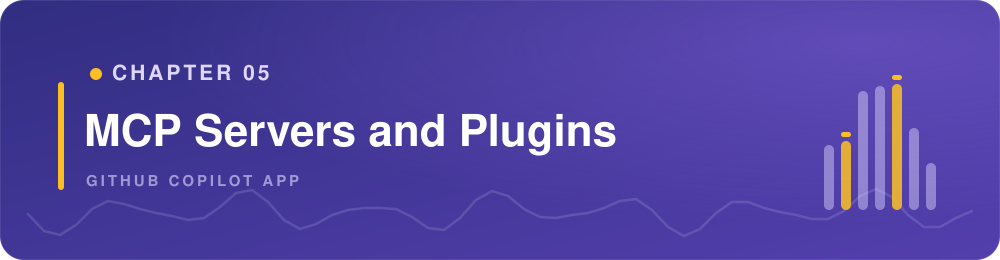
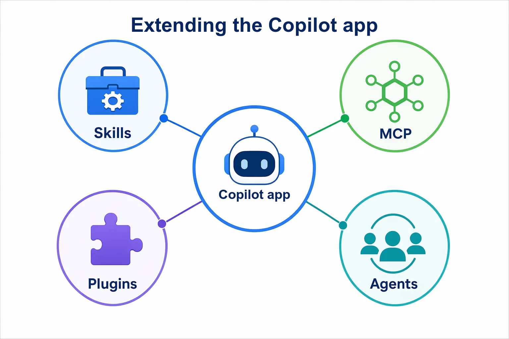
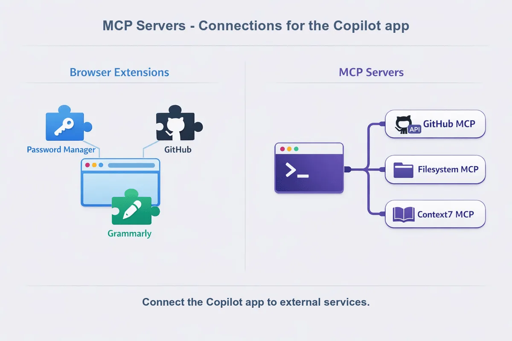
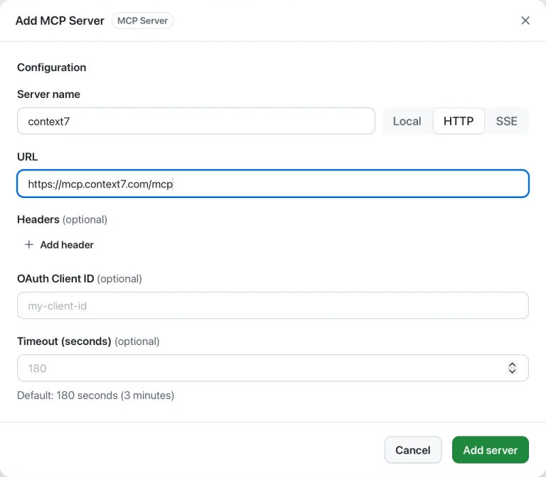
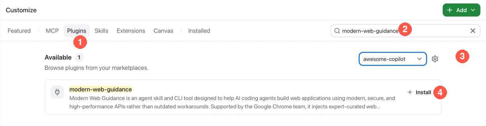

> **What if the agent could look up the documentation it needs instead of relying only on what it already knows?**

Chapter 04 introduced skills and custom agents: reusable instructions and defined roles. This chapter extends what the GitHub Copilot app can access through **Model Context Protocol (MCP) servers** and **plugins**.

You'll use Context7 to retrieve up-to-date documentation, then install a plugin that supplies a web-guidance skill.

## Learning Objectives

By the end of this chapter, you'll be able to:

- Explain what an MCP server is and how it differs from a plugin
- Connect an MCP server and confirm that its tools return useful information
- Install a plugin and invoke one of its skills
- Compare retrieved guidance with local code without sending that code to an external service
- Review permissions and distinguish completed tool activity from an agent's unsupported claims

> ⏱️ **Estimated Time**: ~45 minutes

## Prerequisites

Complete [Chapter 04](../04-skills-custom-agents/README.md) so you're familiar with skills, custom agents, and the **Customize** tab. Use your course fork and the Node.js setup from Chapter 00. You don't need to merge Chapter 04's changes or bring its edited skill and agent profile into this chapter.

Because this chapter starts a new worktree from `main`, the custom agent from Chapter 04 normally won't appear here unless you merged that profile. That is expected.

The Context7 exercise needs internet access and permission to add an MCP server. The plugin exercise needs permission to install a plugin and use its documentation tool, which runs through Node.js. No cloud-provider subscription or deployment is required.

If your organization blocks an integration, read its example and expected output, note that you couldn't run it, and continue with the other exercise. Neither exercise depends on the other.

## From the Studio: Connecting the Gear

A song chart tells musicians what to play, but it doesn't connect a microphone or add an effect to the mixing desk. You choose and connect equipment when the session needs another capability.

An MCP server is like a connection to that equipment: it exposes tools the agent can use. A plugin is like a packaged set of additions you can install. Check what's included and what access it needs before enabling it.



## Core Concepts

### MCP server versus plugin

| Feature | What it adds | Example in this chapter |
|---|---|---|
| MCP server | Tools that connect the Copilot app to a service or data source | Retrieve React's input-label guidance with Context7 |
| Plugin | An installable package of skills, agents, or other capabilities | Use Modern Web Guidance to plan a small CSS improvement |

A plugin can include an MCP server, but the two aren't interchangeable. You can connect a server directly, and a plugin can supply a skill without adding a server.

Find both under the sidebar **Customize** tab. Start with the tools you already have; add an integration only when it supplies something the task needs.

## Create a Practice Session

1. Select **Create from** next to your course project.
2. Select **Branches**, then `main`, to start a session in a new worktree.
3. Set the mode to **Interactive** and confirm that **Default agent** is selected. If the read-only explainer agent from Chapter 04 appears because you merged its profile, don't select it.
4. Submit:

   ```text
   Show this session's branch and worktree path. Confirm that samples/book-app-web/src/components/BookFilters.tsx, samples/book-app-web/src/components/BookCard.tsx, and samples/book-app-web/src/styles/app.css exist here. Do not edit files, run app checks, commit, or push.
   ```

**Expected Output:** The session identifies its worktree and finds the three files.

Keep this session for both exercises and the assignment. You don't need to install the Book App's dependencies or run its development server for these read-only comparisons.

> [!NOTE]
> A worktree separates file changes, not installed tools. MCP connections and plugins can affect other sessions. Before adding either, check whether it's already installed and enabled; don't create a duplicate.

## MCP Servers: Get Information from Another Service

A browser extension can connect your browser to a service, such as a password vault. An MCP server gives the Copilot app a similar connection to tools and data. Here, Context7 provides access to React documentation.



Model Context Protocol defines how an AI application connects to tools and data. An **MCP server** supplies those tools. The server can run on your machine or at a remote service.

The graphic shows example connections, not required installations. The app already has tools to read and search local files. Configure MCP connections under **Customize > MCP**, not the app's **Extensions** tab.

Use MCP when the task needs information or actions that the current tools don't supply. You don't need to add another GitHub server for the issue and pull request work from Chapter 03.

[Context7][context7] is a documentation service with an MCP server. In this example, it supplies React documentation. It doesn't become a dependency of the Book App.


The screenshot shows one Context7 connection after setup. Your **Installed** list can be empty before this exercise. Use one connection per service.

### Exercise: Check the Book App's Input Labels with Context7

In React, a label's `htmlFor` value can match an input's `id` to connect the label to that input.

Start by getting the Context7 MCP server configured in the GitHub Copilot app. If it's already connected, skip the add-server steps.

1. Open **Customize**, then **MCP**.
2. Take a moment to look through the content in the **MCP** configuration screen.
3. Select **Add server** and locate **Context7**.
4. Take a moment to explore the values in the configuration dialog:

   | Setting | Value |
   |---|---|
   | Server name | `context7` |
   | Transport | `HTTP` |
   | URL | `https://mcp.context7.com/mcp` |

   > [!NOTE]
   > HTTP means the Copilot app connects to a hosted server instead of starting a local process.

   

1. Select **Add server**.
2. Confirm that the connection is enabled and connected in the **Installed** view under **Customize**.
3. Return to the chapter session you created earlier. Use **Interactive** mode with the default agent.
4. Submit:

   ```text
   Use the Context7 MCP tools to find the official React documentation for input labels.

   Ask only this general question: How do nested labels compare with htmlFor and id when labeling an input?

   Summarize both patterns and include the source links. Do not send repository code or paths to Context7. If the MCP tools are unavailable, report that and stop.
   ```

1. Expand the tool activity. Confirm that a **Context7** tool returned documentation. Open a source link and compare it with the summary.
2. Submit:

   ```text
   Compare the retrieved guidance with @samples/book-app-web/src/components/BookFilters.tsx. Keep this comparison local. Explain whether Search, Genre, and Status have associated labels. Do not edit files or make more external requests.
   ```

**Expected Output:** The MCP activity contains documentation results. The local comparison identifies the inputs and selects nested inside `<label>` elements. Missing `htmlFor` isn't a defect when a control is inside its label. No source files should change.

**How It Works:** The server supplies documentation through a tool call. The agent then compares that result with local code. Keeping the external question general lets you use the documentation without sending repository content to the service.

## Plugins: Use a Packaged Capability

You can add skills and MCP servers separately, or install them as part of a **plugin**. A plugin can include skills, custom agents, MCP servers, or canvas extensions. A **marketplace** is a catalog of plugins. Installing a plugin is different from invoking one of the skills or agents inside it.

Choose a maintained plugin that provides the capability you need. Read its contents, not only the marketplace description. Some plugins start processes, call services, or run hooks, which are commands triggered by agent events.

> [!TIP]
> **Optional exploration:** After you complete this chapter's exercise, browse the [Awesome Copilot plugin directory][awesome-plugins] to find other community plugins. Use `modern-web-guidance` for this exercise. Before you install another plugin, review its source, included capabilities, and required access.

### Exercise: Plan a CSS Improvement with Modern Web Guidance

The `modern-web-guidance` plugin from [GoogleChrome/modern-web-guidance][modern-web-guidance] supplies a skill that searches web-platform guides. You'll use it for one book-title layout question, not a redesign. This exercise doesn't require the Context7 exercise.

The skill uses `npx` to download and run its documentation tool. Node.js and internet access are required. Review the [skill instructions][modern-web-skill] and any command approval before use.

> [!NOTE]
> Enterprise-managed settings can restrict which plugins and marketplaces are available in the GitHub Copilot app. If you cannot install `modern-web-guidance` or access the `awesome-copilot` marketplace, read the example and expected output, record the exercise as blocked, and continue. Do not change company-managed settings to complete the exercise.

1. In **Customize**, select **Plugins**.
2. Search for `modern-web-guidance`. Use the marketplace filter to select `awesome-copilot`. If that marketplace is missing and your policy permits it, use the gear icon beside the filter to add `github/awesome-copilot`.

   

   The screenshot shows the plugin before installation. After installation, use the live **Installed** view as the check: the plugin should appear there with its enabled toggle on.

1. Confirm that the plugin's source is `GoogleChrome/modern-web-guidance`. Review the plugin's description, then select **Install** if it isn't already installed.
2. Confirm that the plugin is enabled in the **Installed** view under **Customize**.
3. Return to the project session in **Interactive** mode with the default agent. Submit `/skills reload`, then type `/` and select the installed `modern-web-guidance` skill. The displayed command can include a plugin prefix. Add this prompt:

   ```text
   Use the modern-web-guidance skill from the installed plugin. Look up guidance for wrapping a short heading across multiple lines. Use only general terms in external queries.

   Then inspect @samples/book-app-web/src/components/BookCard.tsx and @samples/book-app-web/src/styles/app.css locally. Propose at most one CSS-only improvement for long book titles on narrow screens.

   Name the guide used, explain browser support, and give a browser check. Keep the current design and dependencies. Do not add JavaScript, change files, or run app checks. If the current CSS needs no change, explain why. If the plugin skill is unavailable, stop.
   ```

1. Inspect the skill activity and its guide-search output. Confirm that the recommendation refers to the current book-title element and CSS. A recommendation such as `text-wrap: balance` must explain what happens in browsers that don't support it.

**Expected Output:** The Copilot app loads the plugin's skill and retrieves a relevant guide. It returns a small CSS proposal or a reason to keep the existing layout. The Book App files remain unchanged.

**How It Works:** Unlike the repository skill you edited in Chapter 04, this skill arrived through an installed package. You still invoke it, inspect its tool activity, and check its recommendation against the code. Installation alone doesn't prove that the skill ran.

## Troubleshooting

<details>
<summary>MCP and plugin problems</summary>

### I Cannot Find MCP or Plugins in Settings

Use the sidebar **Customize** tab. Labels and available commands can vary by app version.

### An MCP Server Is Enabled but Its Tools Fail

Check the connection status, URL, authentication, network access, and organization policy. An enabled toggle alone doesn't prove that a server is connected. Use one connection per service. If the service reports a rate limit, wait or use its approved authentication process. Don't put credentials in prompts or repository files.

### A Plugin Is Installed but Its Skill Is Missing

Check the plugin's enabled toggle and current contents. Run `/skills reload`, then search the `/` menu for the skill name, including any plugin prefix. If it still doesn't appear, wait for active work in all sessions to finish, quit and reopen the app, then return to this session. Closing a window isn't the same as quitting the app.

If the plugin no longer supplies the skill, record the exercise as blocked rather than installing an unrelated plugin.

### The Agent Cannot Use the Integration

Confirm that **Default agent** is selected. If you merged the read-only explainer agent from Chapter 04 and it appears in this session, don't select it. Then check tool approvals and organization policy. Don't broaden the explainer's tools or change policy just to finish the exercise.

</details>

---

## Key Takeaways

1. An MCP server supplies tools for retrieving information or performing actions through a connected service.
2. A plugin packages capabilities such as skills, agents, MCP servers, or canvas extensions. Installing one doesn't automatically run its contents.
3. Review what each tool can do and what data it sends. General documentation questions don't need repository code.
4. Check tool activity, retrieved guidance, and any returned source links, not only the agent's statement that an integration worked.
5. Add only the capabilities you need. A worktree doesn't isolate installed tools from other sessions.

## Assignment


Summarize the evidence from these exercises. You don't need another code change or a pull request.

1. In the same session, ask the default agent:

   ```text
   Summarize this chapter's Context7 and Modern Web Guidance exercises in a short table. For each, name the capability used, the evidence that it ran, the source evidence, and what we learned about the Book App.

   For source evidence, include a returned source link when one is available. If the tool returned a guide without a source link, include the guide name and ID instead. Do not invent a link.

   Separate completed work from proposed browser checks. If an exercise couldn't run, state why and do not invent results or sources. Use only this session's existing evidence. Do not edit files, run commands, or make more external requests.
   ```

2. Compare the table with the tool activity, retrieved guidance, and sources. Correct any unsupported claims. Open **Changes** and confirm that the exercises left repository files unchanged.
3. Explain in your own words why the Context7 connection is an MCP server and Modern Web Guidance is a plugin supplying a skill.
4. Disable only the MCP connection or plugin you added for this exercise if you don't want to keep using it. Leave pre-existing tools unchanged. Chapter 06 doesn't require either integration to remain enabled.

**Success criteria:** You can distinguish an MCP connection from a plugin, identify the tool and source evidence from each integration you used, and explain what stayed local. If an integration was blocked, your summary says so instead of claiming it ran. No Book App files changed.

## What's Next

You now know how to connect external tools and use packaged capabilities without confusing installation with successful execution.

In Chapter 06, you'll use canvases to keep a session's plan, progress, and validation evidence visible. You'll start by exploring a community canvas installed through a plugin, building on the installation workflow from this chapter.

[**← Back to Chapter 04**](../04-skills-custom-agents/README.md) | [**Continue to Chapter 06 →**](../06-canvases/README.md)

---

## Source References

- [Customizing the GitHub Copilot app][customizing]
- [Adding MCP servers for Copilot CLI (also used by the app)][mcp-setup]
- [Context7 source and setup][context7]
- [React: Providing a label for an input][react-input-label]
- [About GitHub Copilot plugins][plugins]
- [Modern Web Guidance source][modern-web-guidance]
- [Modern Web Guidance skill instructions][modern-web-skill]
- [Slash commands for the GitHub Copilot app][slash-commands]
- [Awesome Copilot plugins][awesome-plugins]

[customizing]: https://docs.github.com/en/copilot/how-tos/github-copilot-app/customize-github-copilot-app
[mcp-setup]: https://docs.github.com/en/copilot/how-tos/copilot-cli/customize-copilot/add-mcp-servers
[context7]: https://github.com/upstash/context7
[react-input-label]: https://react.dev/reference/react-dom/components/input#providing-a-label-for-an-input
[plugins]: https://docs.github.com/en/copilot/concepts/agents/about-plugins
[modern-web-guidance]: https://github.com/GoogleChrome/modern-web-guidance
[modern-web-skill]: https://github.com/GoogleChrome/modern-web-guidance/blob/main/skills/modern-web-guidance/SKILL.md
[slash-commands]: https://docs.github.com/en/copilot/reference/github-copilot-app-reference/slash-commands
[awesome-plugins]: https://awesome-copilot.github.com/plugins/
