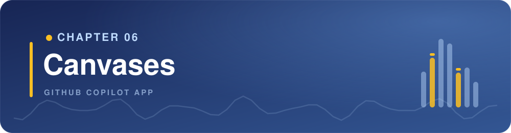

> **What if you and the agent shared a real-time progress board instead of a buried chat thread?**

Chapter 05 introduced MCP servers and plugins. Now you'll use a canvas extension, which can be installed through a plugin or created for your own workflow.

Chat works well for instruction and ambiguity. Once a GitHub Copilot session is doing real work, a long chat thread becomes hard to scan. You need a visible workspace for human-agent collaboration.

That place is a **canvas**.

A canvas is a shared board in the side panel. You create it with `/create-canvas` and describe the board you want. The app builds it from your prompt and keeps it in sync with you and the agent.

This chapter asks `/create-canvas` for a **session board**: plan steps, validation checks, and notes.

## Learning Objectives

By the end of this chapter, you'll be able to:

- Explain why canvases exist and when a long chat thread gets in the way
- Create a session canvas with `/create-canvas`
- Keep plan state and validation evidence visible on that canvas
- Explain the difference between chat history and a canvas that keeps current information visible and editable

> ⏱️ **Estimated Time**: ~70-90 minutes

---

## Prerequisites

1. Exercise 1 installs a community plugin. Enterprise-managed settings can restrict which plugins and marketplaces are available in the GitHub Copilot app. If you cannot install the plugin, read Exercise 1 and continue to Exercise 2.
1. Confirm the sample app is ready.

    - Use **Create from** > **Branches** > `main` to start a new worktree session for the course repository. Select **Interactive** mode and **Default agent**.
    - In the review panel's **Terminal** tab, run the following commands from the worktree's repository root:

        ```bash
        cd samples/book-app-web
        npm install
        npm test -- --run
        npm run build
        ```

Confirm these results before you start the exercise:

| Command | Expected result |
|---|---|
| `npm install` | Installation completes without an error |
| `npm test -- --run` | Vitest reports that all test files and tests passed |
| `npm run build` | TypeScript and Vite complete the build without an error |

Note the test file and test totals. Your canvas will use these values as its baseline.

---

## From the Studio: The Band's Arrangement Board

Imagine a band planning a song. They could argue their options in a long group chat, where decisions get buried, or they could use a shared arrangement board to keep everything visible and organized.

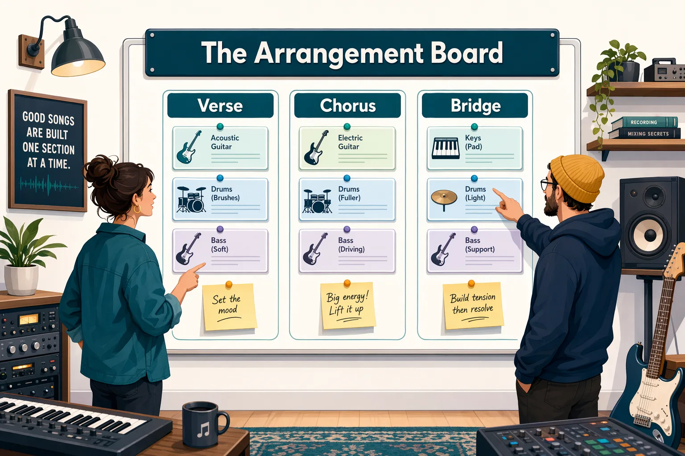

| Group chat | Arrangement board |
|---|---|
| Good for discussion | Good for information that you and the agent both update |
| Hard to scan later | Easy to inspect at a glance |
| Mostly linear | Can show sections, parts, previews, and controls |
| Updates are buried | Updates are visible |

A canvas is the app's arrangement board for human-agent work.

| Term | Meaning in this course |
|---|---|
| Built-in work surfaces | Plan output, terminal, browser, and the Review panel you've already seen in a session |
| Session canvas | The board `/create-canvas` opens in the side panel for this session |

---

## Core Concepts

### A canvas is a shared control panel

Canvases are documented as **bidirectional** work surfaces: both sides (user and agent) can change the same board.

Simple example:

1. GitHub Copilot adds plan steps to the board.
2. You uncheck a step or write "pause before edits" in the notes.
3. GitHub Copilot continues from *your* update, not from a buried chat sentence.

A custom canvas can include:

- visible state
- UI controls
- agent-callable actions, such as updating a checklist item
- artifacts such as plans, checklists, dashboards, browser previews, terminals, or documents

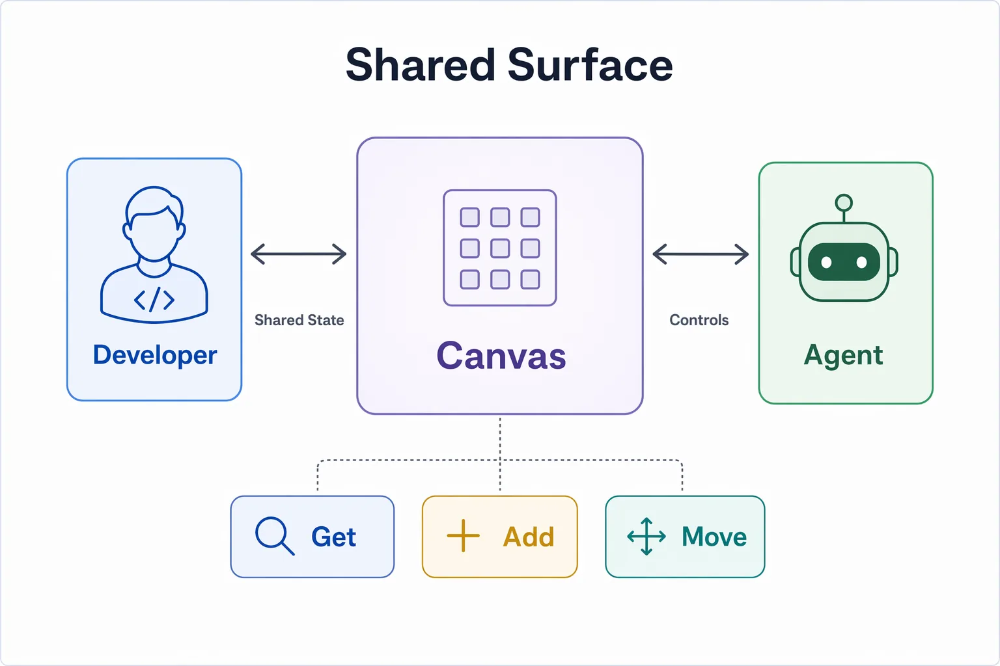

<details>
<summary>Terms used in the exercises</summary>

| Term | Meaning |
|---|---|
| Agent-callable action | A canvas control that can ask the agent to do work, such as running tests |
| User scope | The canvas is available to you across projects and is not committed to this repository |
| Local-only UI | A control that changes only what you see and does not tell the agent about the change |
| Event | A recorded state change, such as a plan being approved |
| Polling | Checking at intervals for a state change |
| Timeout | The maximum time an action can run before it stops |

You do not need to write extension code in this chapter. These terms help you understand the detailed prompt in a later exercise and diagnose a generated canvas.

</details>

### Built-in work surfaces come first

You already used these panels in earlier chapters. They come with the session. You don't create them.

| Built-in work surface | What you inspect |
|---|---|
| Plan | Execution plan and a checklist of steps before implementation |
| Terminal | Install, test, and build evidence |
| Browser | Running app behavior |
| Changes / Review panel | What changed and what still needs review |

Those panels stay tied to the live session. In this chapter, you'll add one more surface: the session board.

### When to use a canvas

| Use chat when... | Use a canvas when... |
|---|---|
| You need a quick answer | You need visible state |
| The task is short | The task has multiple recurring steps |
| The result can be text | The result needs controls or inspection |
| You don't need to revisit it | You want a reusable work surface for the session |

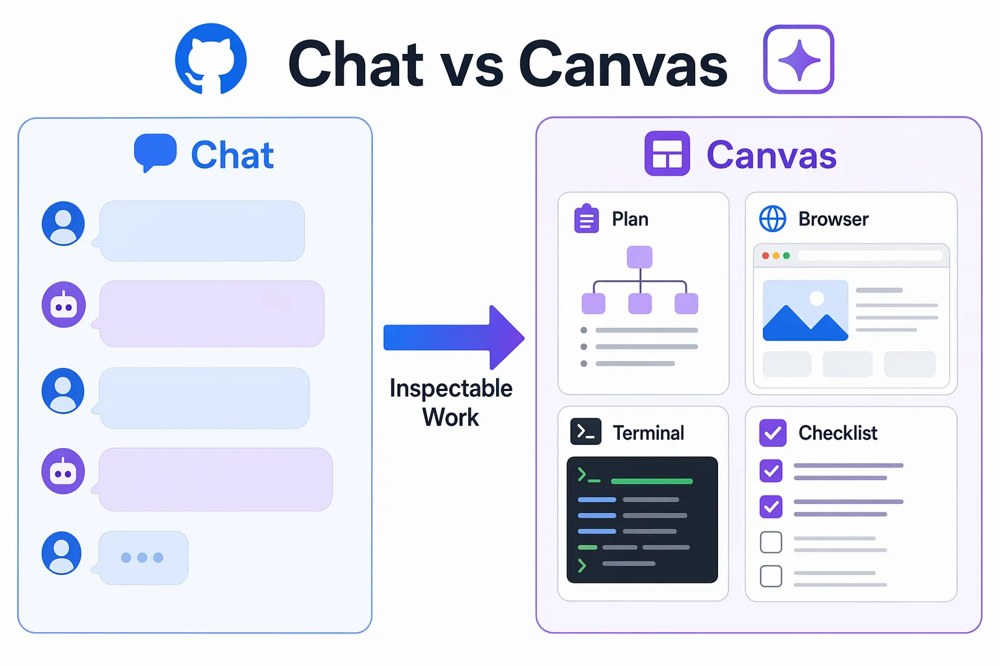

## Exercise 1: Try Your First Canvas

Before building your own canvas, try one from the community. [Awesome GitHub Copilot][awesome-copilot] is a curated collection of agents, instructions, skills, and canvas extensions you can install into the GitHub Copilot app. The [Repository Issues Kanban][issues-kanban] is a good first canvas to explore. It pulls repository issues into a kanban board you can triage and track inside a session.

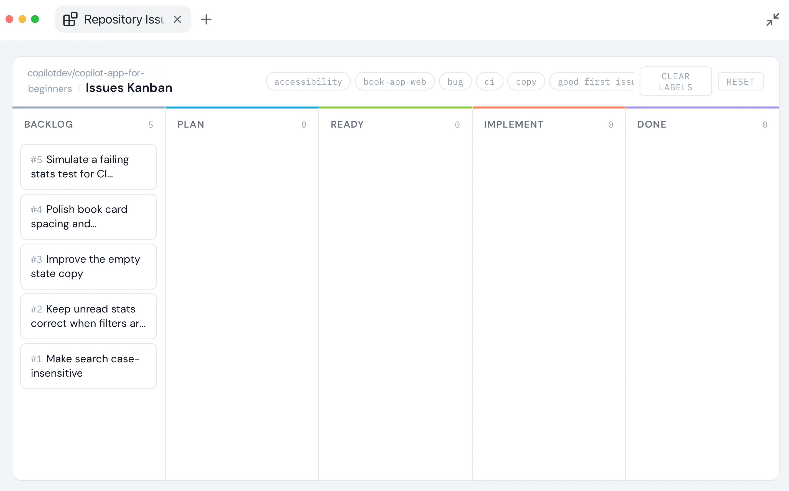

1. From the canvas page, select **+ Install in GitHub Copilot app** to install it in your GitHub Copilot app.

    - Select **Allow** when prompted to install the plugin.
    - Select **Install** to install it from the Awesome Copilot marketplace. The package name is `accessibility-kanban@awesome-copilot`.
    - Ensure the plugin is listed under your installed and enabled plugins.

1. Return to the worktree session you prepared in the prerequisites and submit the prompt `Restart canvas extensions`. This will reload the extensions and pick up the newly installed one.
1. Navigate to **View** > **Toggle Review Panel** > **+** > **Extensions** and select **Repository Issues Kanban**. The package is named `accessibility-kanban`, but **Repository Issues Kanban** is the name shown in the app.

    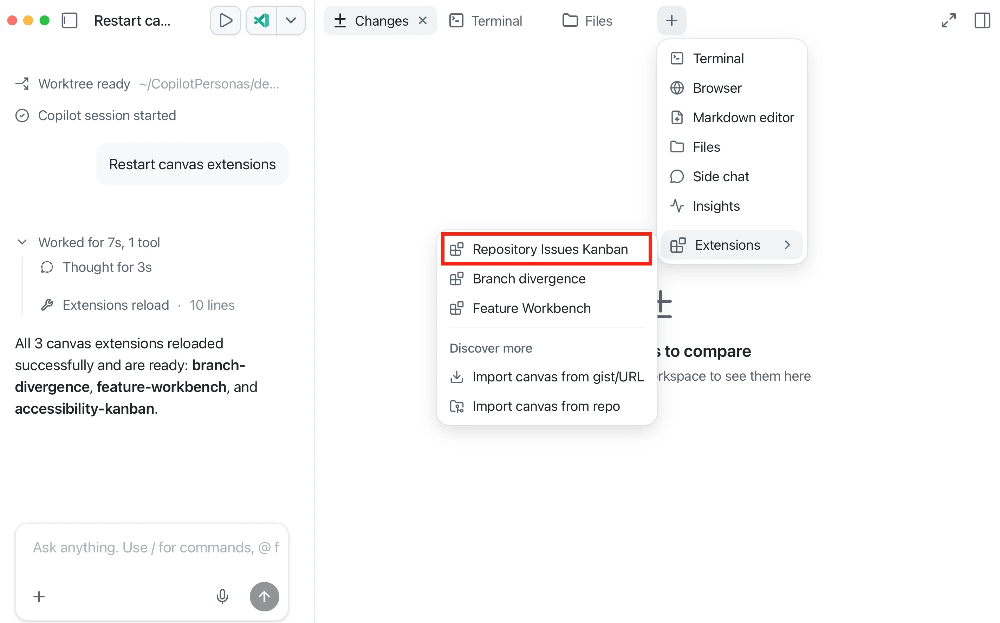

1. The board loads issues from the current repository and organizes them by status.
1. Drag an issue between columns and notice how the canvas keeps state visible without scrolling through chat.

Take a minute to move items around. This is the interaction model you will build on in Exercise 2.

## Exercise 2: Create a session board

Start with a small canvas that works like a shared checklist. You and the agent can both see and update the same feature proposal, checklist, and notes. This exercise lets you practice those basic interactions before Exercise 3 adds buttons that ask the agent to run development tasks.

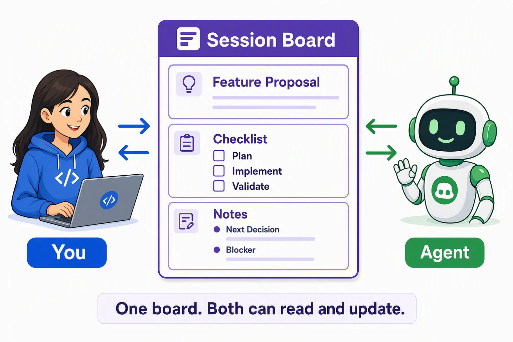

1. In the current session, type `/` in the prompt box and select `/create-canvas`, then paste this prompt:

    ```text
    Create a simple, user-scoped Session Board canvas.

    Include:
    - A Feature proposal text field
    - A checklist with Plan, Implement, and Validate
    - A Notes section with Next decision and Blocker fields

    Let both the user and the agent update the checklist and notes. Keep the layout compact and beginner-readable. Do not edit repository files, run commands, or write to GitHub while creating the canvas.
    ```

1. When the canvas opens, confirm that it has the proposal, checklist, and notes sections.
1. Enter a short feature proposal.
1. Mark **Plan** complete and add a next decision.
1. Ask the agent to summarize the current board state. Confirm that its answer matches your updates.
1. Open **Changes** and confirm that creating the user-scoped canvas did not change repository files.

**Expected result:** The feature proposal, checklist, and notes remain visible on the board. You and the agent can both read and update them, but the board does not run tests or edit the app.

## Exercise 3: Create a Feature Workbench

You will build a reusable canvas that manages the local development inner loop for a new book-app feature. It keeps the feature proposal, plan, implementation and evidence linked to the same session.


Exercise 2 showed how you and the agent can read and update the same proposal, checklist, and notes. Now you will add canvas buttons that ask the agent to run development tasks and record the results.

> [!TIP]
> Use the most capable model available to you when you create the canvas. The first generation needs more reasoning. After the canvas works, you can use a smaller, faster model for focused changes.

1. In the current session, type `/` in the prompt box and select `/create-canvas`, **then** paste the prompt below:

    <details>
    <summary>Feature Workbench canvas prompt</summary>

    ```text
    Create a reusable, user-scoped Feature Workbench canvas for the local dev inner loop in @samples/book-app-web. Simple, compact, beginner-readable. No GitHub writes, no source edits while building it.

    Every button = agent-callable action (loading/success/error state, saves agent response). No local-only UI.

    Top: horizontal progress rail = Propose -> Plan -> Baseline -> Implement -> Validate. No Approve stage. Approval happens in the chat's Plan tab. Green = evidence-backed done, neutral = current, red = failed/blocked.

    Feature proposal: text input + one Generate plan button. Switches session to plan mode, fires prompt without waiting ("Working..." status), agent inspects code + writes plan as usual, presents for approval in Plan tab (never call exit_plan_mode/ask_user elsewhere). Don't render plan text on canvas. Show only a small status pill (Working/Review/Approved/Changes requested) polled from exit_plan_mode events. No edit/approve controls on the canvas itself.

    Checklist: baseline test, baseline build, implement approved plan, review diff, browser validation (when required), screenshots (when required), final test, final build.

    Actions in order: Run baseline (test+build, record totals) -> Implement (approved plan only) -> Browser validation (start/reuse dev server, exercise feature, before/after screenshots) -> Run final checks (test+build) -> Refresh evidence. These 4 must never use plan mode/exit_plan_mode/ask_user (unattended), give each a multi-minute timeout not the ~60s default.

    Evidence: read-only, agent-posted only, no learner notes. Dense one-liners: baseline pass/fail pill, final pass/fail pill + total delta, browser summary + screenshot count, diff summary (files changed), blockers. Truncate long text. Green only if tests pass and final total >= baseline. Before any evidence: "Run a check or capture browser evidence to record it here."

    Only mark checklist/rail items from recorded evidence, never chat inference. Dense layout, no big empty textareas, no duplicate buttons, user scope.
    ```
    </details>

    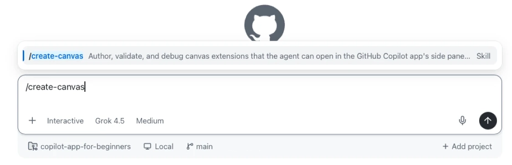

1. The canvas should open in the right side panel once the agent is done building it.

    >[!IMPORTANT]
    > Generated results can differ between runs. Check the expected structure below before you continue. Do not repeatedly regenerate the full canvas.

    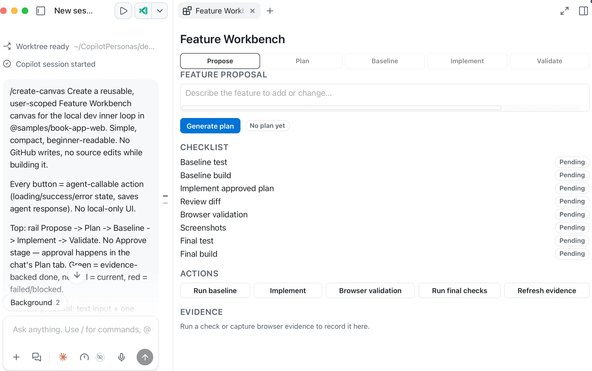

    Confirm that the canvas has:

    - Five stages: **Propose**, **Plan**, **Baseline**, **Implement**, and **Validate**
    - One feature proposal field and one **Generate plan** button
    - Eight checklist items
    - Actions for baseline, implementation, browser validation, final checks, and evidence refresh
    - An empty evidence area before any action runs

    If one part is wrong, use the matching repair prompt:

    <details>
    <summary>Repair prompts (use the one matching what's wrong)</summary>

    ```text
    Keep the current canvas. Add any missing stages, checklist items, or actions from my original request. Do not redesign parts that already work.
    ```

    ```text
    Keep the current canvas. Update checklist and progress state only from recorded action evidence. Do not infer success from chat text.
    ```

    ```text
    Keep the current canvas. Give baseline, implementation, browser validation, and final-check actions enough time to complete npm and browser work. Show loading, success, and error states.
    ```

    </details>

    If the canvas still does not match after two focused repairs, use the [Markdown fallback](#markdown-fallback) and continue with the validation steps manually.

1. In **Feature proposal**, paste the following, then select **Generate plan**:

    ```text
    Add a Clear filters control that resets search, genre, and reading status to their default values. Show it only when at least one filter is active.
    ```

    This will:
    - Switch the session mode to **Plan**
    - Send a prompt that asks the agent to create an implementation plan for the proposed feature
    - Keep the canvas at the **Propose** stage and show the status as **Working ...**

        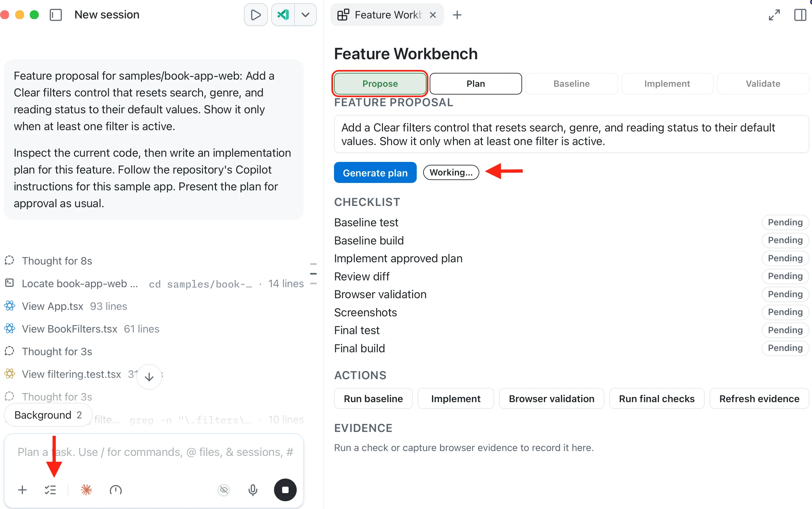

1. Review the visible plan in the **Plan** tab. In the plan approval controls, select **2. Exit plan mode and I will prompt myself**. Then return to the canvas. The **Plan** stage should be complete, and the feature status should show **Approved**.

    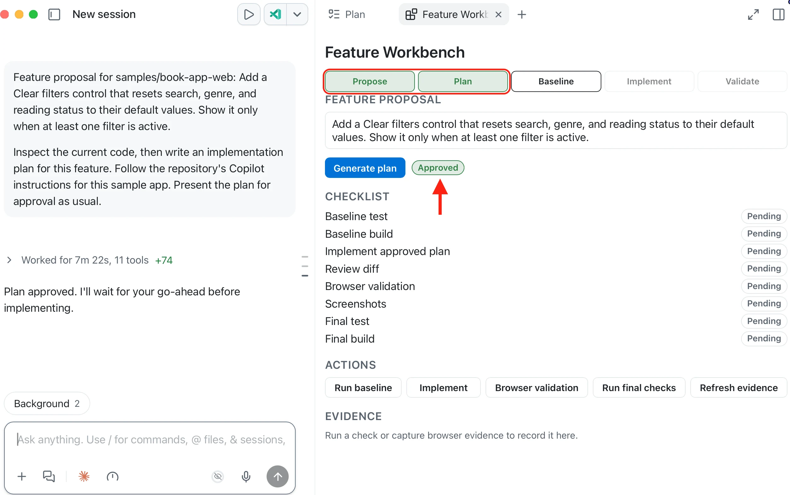

1. Select **Run baseline** on the canvas. This ensures that the initial state of the application is recorded before making any changes.

    Confirm that the canvas records the individual Vitest test total and build result from terminal output. Expand the working section in the chat to confirm that the right test commands were executed and that the evidence matches the reported results. 
    
    The board is useful only when it stays linked to evidence from the same session. Checking a validation box because the chat sounded confident is not enough.

    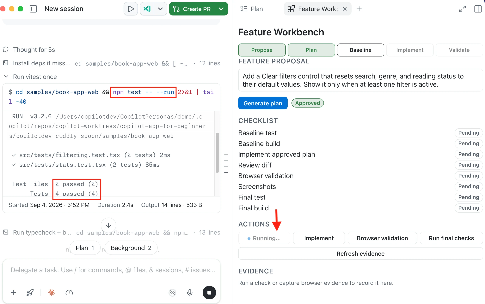

    When the action finishes, the **Baseline** stage should show as complete. The baseline test and build items should show **Done**, and the evidence should include the number of tests.

1. Select **Implement** to build the feature according to the generated plan.

    See the **Changes** tab to review the modifications and confirm it is limited to the approved feature. The canvas will update to reflect the current **Implement** stage, check off items related to implementation on the checklist and include Diff changes as part of the evidence.

    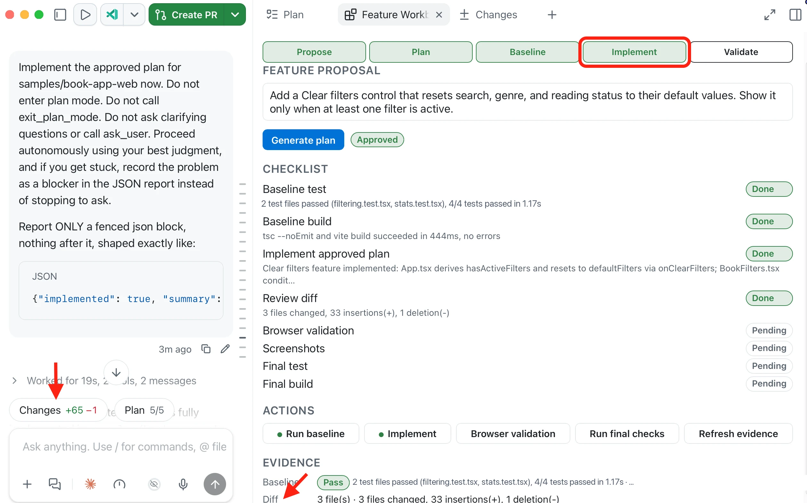

1. Select **Browser validation** to have the agent perform a visual check in the browser. You can manually test the feature by interacting with the application and observing the visual changes. In the browser, apply a filter and confirm **Clear filters** appears.

    Complete all of these checks:

    | State | Expected behavior |
    |---|---|
    | No filters are active | **Clear filters** is not visible |
    | A search term is active | **Clear filters** is visible |
    | A genre or reading status is active | **Clear filters** is visible |
    | You select **Clear filters** | Search, genre, and reading status return to their defaults |
    | Filters have been cleared | **Clear filters** is not visible, and the full book list and statistics return |

    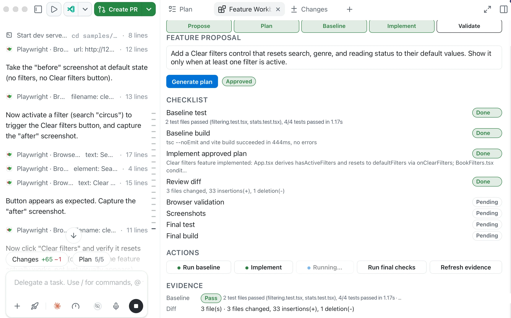

1. Select **Run final checks** to confirm that the existing automated checks still pass.

    Compare the final evidence with your own baseline. Test counts can increase if implementation adds focused tests, but the final total must not be lower than the baseline total.

    | Evidence | What to confirm |
    |---|---|
    | Baseline | Test and build results match the original terminal output |
    | Diff | Changed files are limited to the approved feature |
    | Browser | All five browser states above were checked |
    | Final | Tests and build pass, and the final test total is at least the baseline total |

    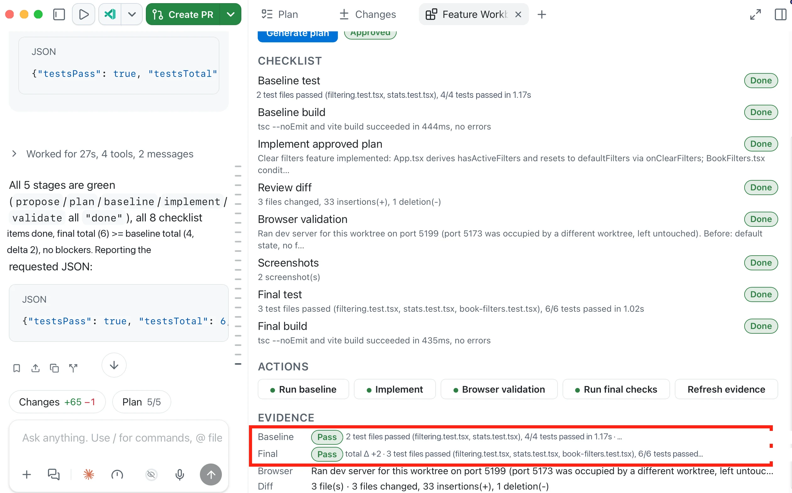

You've seen how the workbench reflects what actually happened in the session, not because a chat response sounds confident. Copilot can update the canvas after an action gathers evidence, but you decide whether that evidence is sufficient.

<a id="markdown-fallback"></a>

<details>
<summary>Optional: Markdown fallback if the canvas doesn't work</summary>

### Markdown fallback

If `/create-canvas` is unavailable or the generated canvas still does not work after two focused repairs, keep the same workflow in a Markdown artifact:

```text
Create a Markdown artifact named feature-workbench.md. Do not add it to the repository.

Include the Propose, Plan, Baseline, Implement, and Validate stages; the eight checklist items from my Feature Workbench request; and an Evidence section for baseline checks, changed files, browser validation, final checks, and blockers.

Update an item only after the current session produces matching terminal, diff, or browser evidence.
```

Open the artifact from the session's **Files** tab. Run the baseline, implementation, browser, and final-check steps from the session, then ask the agent to update the artifact with the evidence you verified. The Markdown artifact does not have action buttons, but it keeps the same plan and validation record visible.

</details>

<details>
<summary>Behind the canvas: Where canvas files live</summary>

You ran `/create-canvas` in Exercises 2 and 3. Opening the generated files is optional.

| Location | Scope | Best for |
|---|---|---|
| `~/.copilot/extensions` | User | Personal experiments. Prefer this in the course so nothing is committed |
| `.github/extensions` | Project or team | Shared course and team workflows |

A canvas commonly includes `package.json`, an entry file such as `extension.mjs`, and optional JSON artifacts for persisted state.

Pause before accepting extra generated code. Inspect capability names, stored state, UI controls, and whether any private data is included.

If a canvas fails to open after edits, check extension dependencies, reload requirements, syntax errors, and whether the app is reading the user-scoped or project-scoped folder.

</details>

---

## Troubleshooting

If you are still stuck, see the [Troubleshooting Reference](../appendices/troubleshooting-reference.md).

<details>
<summary>Canvas issues</summary>

| Problem | What to check |
|---|---|
| No canvas opens | Confirm you typed `/create-canvas`. Restart canvas extensions once. If the command or panel is still missing, use the [Markdown fallback](#markdown-fallback) |
| Community canvas is not listed | Look for **Repository Issues Kanban**. `accessibility-kanban` is the package name, not the display name |
| Generated layout is incomplete | Compare it with the expected structure and use one focused repair prompt |
| Plan stays in Working state | Complete the plan approval control in the **Plan** tab, then refresh the canvas evidence |
| Built-in terminal or browser missing | Review panel toggle, View menu, app version |
| Agent says it updated the board but state looks wrong | Ask for the full board again and compare it with terminal or browser evidence |
| Validation marked complete without proof | Require evidence; uncheck items that lack output |
| Baseline and final totals look wrong | Compare both values with terminal output from this worktree. Do not copy totals from an example image or another session |
| Browser or terminal validation is stale | Confirm the command ran in the correct `samples/book-app-web` worktree |
| Sensitive data appears in a custom canvas | Remove it, regenerate safe sample data, retake screenshots |

</details>

---

## Key Takeaways

1. A canvas gives the session a visible, shared board in the side panel.
2. Create that board with `/create-canvas` and a short description.
3. Community canvases from [Awesome GitHub Copilot][awesome-copilot] let you install and try the interaction model before building your own.
4. Evidence on the board should come from actual terminal or browser output, not from chat inference.

---

## Assignment


### Core assignment

Extend the Feature Workbench with an **Assess** stage after **Propose**. The stage must compare a feature proposal with the app's current behavior before planning starts.

Pick one small, beginner-safe improvement in `samples/book-app-web` that you have not already shipped in an earlier chapter.

1. Add an **Assess** stage after **Propose** to evaluate the feature proposal against the app's current behavior.
1. Run the workbench through assess, plan, baseline, implement, and validate.
1. Confirm that each completed stage has evidence from the current session.

**Core success criteria:** The canvas shows evidence-backed progress from assessment through local validation, and you can identify the next decision without rereading the whole chat.

### Optional GitHub workflow challenge

Complete this challenge only if you have permission to create issues and pull requests in the training repository. Review the [issue and pull-request workflow from Chapter 03](../03-development-workflows/README.md) before you start.

1. Add actions that create an issue for the assessed feature.
1. Create a pull request that links to the issue.
1. Request Copilot review.
1. Keep the issue, pull-request link, and review status visible as evidence on the canvas.

**Challenge success criteria:** The canvas shows an open pull request linked to the issue, with Copilot review requested. Do not merge the pull request as part of this assignment.

---

## What's Next

In Chapter 07, you'll turn repeatable prompts into automations. You'll start with a manual open-work summary before trying schedules or cloud workflows. You don't need to merge this chapter's feature or keep its canvas open to continue.

**[← Back to Chapter 05](../05-mcp-plugins/README.md)** | **[Continue to Chapter 07 →](../07-automations/README.md)**

---

## Source References

- [Working with canvas extensions][canvas-extensions]
- [Customizing the GitHub Copilot app][customize-app]
- [GitHub Copilot app generally available][app-changelog]
- [GitHub Copilot app product blog][app-blog]

[canvas-extensions]: https://docs.github.com/en/copilot/how-tos/github-copilot-app/working-with-canvas-extensions
[customize-app]: https://docs.github.com/en/copilot/how-tos/github-copilot-app/customize-github-copilot-app
[app-changelog]: https://github.blog/changelog/2026-06-17-github-copilot-app-generally-available/
[app-blog]: https://github.blog/news-insights/product-news/github-copilot-app-the-agent-native-desktop-experience/
[awesome-copilot]: https://awesome-copilot.github.com/
[issues-kanban]: https://awesome-copilot.github.com/extension/accessibility-kanban/
