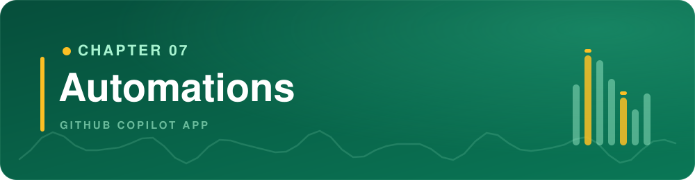
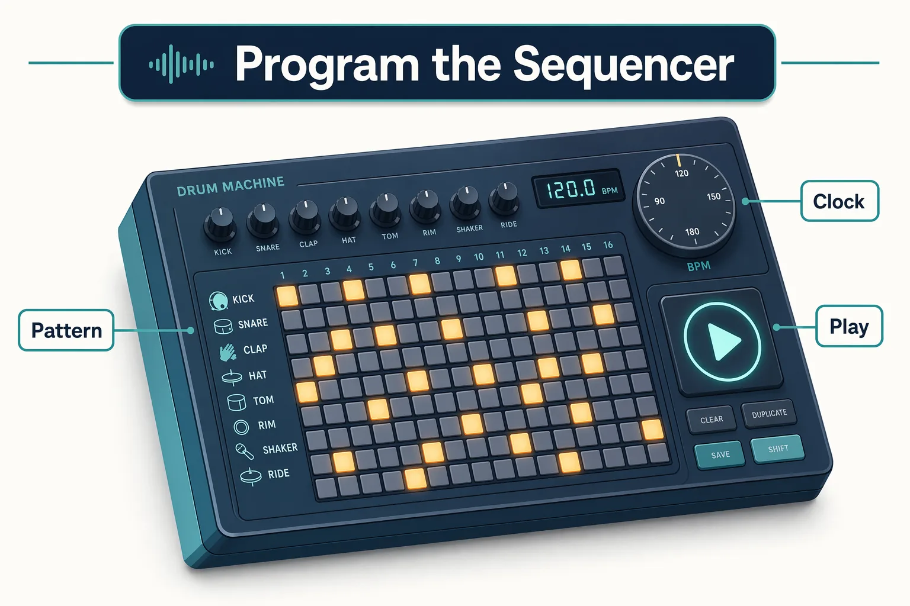
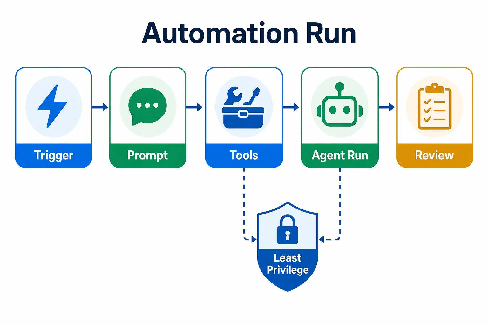
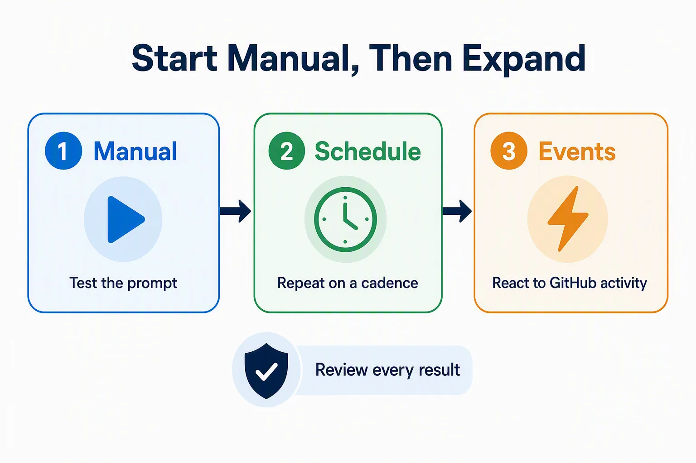
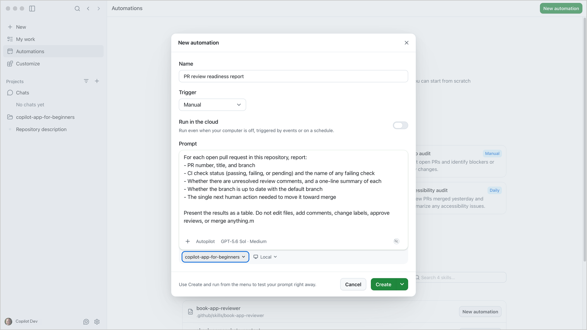
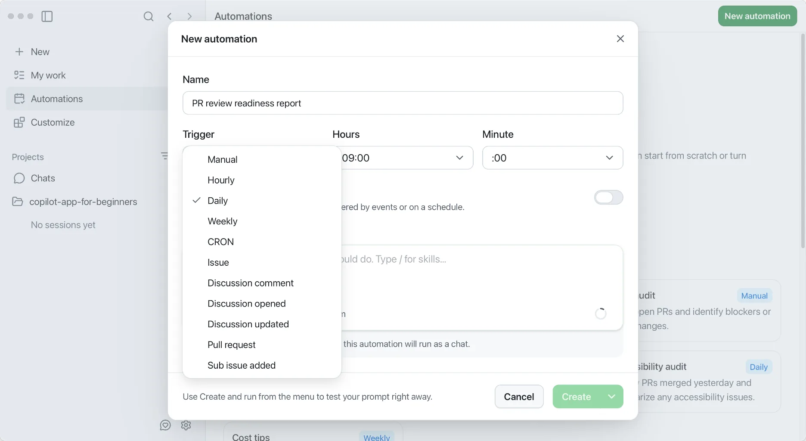
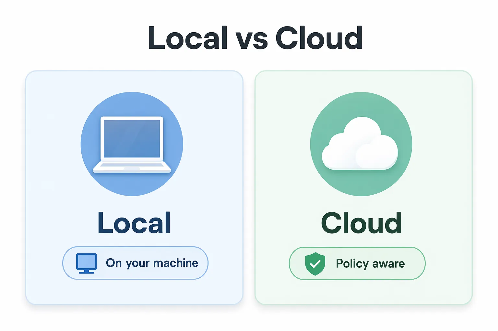
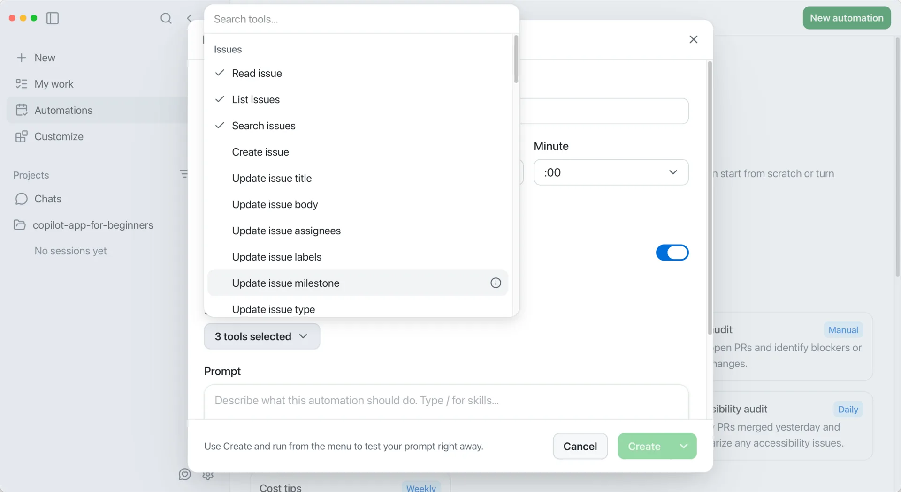

> **What if a prompt you run every morning could run itself?**

Chapter 06 made session work visible with canvases. This chapter makes repeatable work reusable.

Automations let you save agent tasks in the GitHub Copilot app and run them on demand or later on a schedule. You'll start with a manual review readiness report that runs only when you choose, then schedule it so the summary is waiting each morning. The chapter closes with event triggers and cloud automations.

## Learning Objectives

By the end of this chapter, you'll be able to:

- Explain when to automate recurring agent work instead of starting a manual session
- Create and test an on-demand local automation
- Schedule an automation and review its run history
- Recognize event triggers (issue-created, pull-request) and when they are appropriate
- Understand cloud automations

> ⏱️ **Estimated Time**: ~50 minutes

---

## Prerequisites

Complete [Chapter 06](../06-canvases/README.md) and the preceding chapters. You'll reuse **My work** from Chapter 03 and the tool-access principles from Chapters 04 and 05. You don't need to keep a canvas open or an MCP server or plugin enabled for this chapter.

If you skipped the setup script earlier, [run it now](../00-setup/README.md#seed-the-repository) before the first automation exercise. The review readiness report needs open pull requests to inspect.

---

## From the Studio: Programming the Sequencer

A producer does not replay the same drum pattern by hand every night. They program it into a sequencer once and let it run when needed:



| Sequencer | App automation |
|---|---|
| Programmed pattern | Saved prompt |
| Hit play | Manual trigger |
| Run on the clock | Schedule |
| Chosen instruments | Selected tools |
| Producer checks the mix | Human reviews the result |

Start with a manual automation so you can test the prompt safely before giving it a schedule or trigger.

## Core Concepts

### Automation Is a Saved Agent Run

An automation has four beginner-friendly parts:

| Part | Question |
|---|---|
| Trigger | What starts it? |
| Prompt | What should the agent do? |
| Tools | What is the least access needed? |
| Review path | Where do I inspect the result? |



### Local versus cloud, in one line

- **Local automation**: runs from your machine while the app can reach the project
- **Cloud automation**: can run on GitHub-hosted infrastructure when policy and repository settings allow it

Start local and manual. Add cloud only after the prompt is trustworthy.

### Start Manual

Manual automations run on demand. They're the safest first step because you can:

- test the prompt
- inspect output
- adjust scope
- avoid surprise runs
- confirm tools are minimal



### A Good Starter Automation

Pick work you already do more than once:

- "Which pull requests are blocked, and what do they need next?"
- "What validation steps should I run before opening a PR?"

Avoid first automations that write code, post comments, change labels, approve reviews, or merge pull requests.

> 💡 **Tip**: Automations are saved in the app, not committed with the repository. Treat the prompt like production instructions: keep secrets out of it, and give the automation only the tools it needs.

> ⚠️ **Security note**: Issue titles and bodies can contain untrusted text. A read-only summary is safer than an automation that posts comments or edits the repository. That reduces **prompt-injection** risk, where hostile text tries to steer the agent.

---

## Hands-On Exercises

In these exercises, you'll:

- Create a manual review readiness report automation
- Run it and inspect its history
- Schedule that automation so it runs daily without a manual trigger

### Confirm Work Items Exist

Before creating the automation, confirm work items exist. Open **My work** and filter to your fork:

```text
repo:YOUR-OWNER/copilot-app-for-beginners is:pr is:open
```

Replace `YOUR-OWNER` with the username or organization that owns your fork. You should see at least three open pull requests from the Chapter 00 setup script: one with a failing CI check, one with an unresolved review comment, and one that is ready to merge. If the list is empty, [run the script now](../00-setup/README.md#seed-the-repository) before continuing.

### Exercise: Create a Manual Review Readiness Report

This automation answers a real daily question: which pull requests are ready to merge, and what's blocking the ones that aren't?

**My work** already lists your open pull requests, but it doesn't synthesize merge-readiness across them. A review readiness report adds that analysis: CI status, unresolved comments, and what each PR needs next.

To create an automation:

1. Open **Automations** in the sidebar.
1. Select **New automation**.
1. Provide a name for the automation: `PR review readiness report`
1. Select **Manual** as the trigger.
1. Paste the prompt below:

   ```text
   For each open pull request in this repository, report:
   - PR number, title, and branch
   - CI check status (passing, failing, or pending) and the name of any failing check
   - Whether there are unresolved review comments, and a one-line summary of each
   - Whether the branch is up to date with the default branch
   - The single next human action needed to move it toward merge

   Present the results as a table. Do not edit files, add comments, change labels, approve reviews, or merge anything.
   ```

1. Select the arrow next to **Create**, then select **Create and run**.

   

   **Expected output:** Your automation should appear under **Your automations** with the **Manual** label. The run should start immediately and appear under **Recent runs**.

1. Wait for the run to complete. The status should change to a success indicator.

1. Open the run detail and confirm:
   - The **prompt** matches what you pasted above.
   - No **error text** appears. If the result is empty, check that the Chapter 00 setup script created practice pull requests.
   - The **result** includes a table of open pull requests with CI status, comment status, and the next action for each. A representative result from the seeded PRs looks like:

   | PR | CI | Comments | Next action |
   |---|---|---|---|
   | #5 Improve empty-state copy | ✅ Pass | ⚠️ 1 unresolved; reviewer asks for more helpful guidance | Address the review comment |
   | #6 Failing stats check practice | ❌ Fail: Book app web | None | Fix the failing test in `ReadingStats.tsx` |
   | #7 Reading dashboard merge-readiness | ✅ Pass | None | Ready to merge |

Your PR numbers and titles may differ. The key is that each row includes CI status, comment status, and a concrete next action. If the table is empty, confirm the Chapter 00 setup script created practice pull requests, then check repository permissions.

**How it works:** The automation saves the prompt and trigger so you can run the same bounded task again later. Because the prompt is read-only, the risk stays low while you learn the review loop. Unlike **My work**, which lists open items, this report explains why a PR is blocked, not only that it exists.

---

### Exercise: Schedule the Review Readiness Report

The manual report worked. Now make it run every morning so the summary is waiting when you start your day.

1. Open **Automations** in the sidebar and find your `PR review readiness report`.
1. Select the automation, then select **Edit**.
1. Change the **Trigger** from **Manual** to **Daily**.
1. Choose a time that runs before your workday starts, for example **08:00**.

   Before you save, narrow the scope so the scheduled report stays useful:

      - Confirm the automation targets only your fork, not every repository you can access. You can **Select project** to narrow it down.
      - If the prompt is noisy after a few runs, add a label or branch filter to reduce the output.

1. Save the automation.

   After saving:

   - Check the automation card. It should show the **Daily** label and the next scheduled time.
   - The next morning, open the **run history** and confirm a new run completed.
   - If the summary is too long or noisy, tighten the prompt. For example, limit it to PRs with failing checks, then save again.

**Expected result** The automation card shows a daily schedule. The next run appears in the history without you pressing play. If the result is noisy, you know where to narrow the prompt.

### Why schedule instead of running manually?

A manual automation answers "What's the status right now?" A scheduled automation answers "What changed since yesterday?" without requiring you to remember to ask.

> 💡 **Tip**: The app also supports **Hourly**, **Weekly**, and **CRON** schedules. CRON gives you the most control. The app validates the expression and shows a human-readable preview before you save.

---

## Event Triggers

Schedules run on the clock. Event triggers run in response to something happening in the repository.

The current Trigger menu includes these event triggers:

| Trigger | Fires when... | Example use |
|---|---|---|
| **Issue** | A matching issue event occurs | Summarize issue activity for triage |
| **Discussion comment** | A comment is added to a discussion | Summarize new discussion feedback |
| **Discussion opened** | A discussion is opened | Prepare a short discussion summary |
| **Discussion updated** | A discussion is updated | Report what changed in a discussion |
| **Pull request** | A matching pull request event occurs | Summarize changes for a reviewer |
| **Sub issue added** | A sub-issue is added | Report changes to an issue breakdown |

Choose the trigger that matches the event you want the automation to handle. Schedule choices such as **Hourly**, **Daily**, **Weekly**, and **CRON** appear in the same menu.



### Keeping event triggers safe

Event-triggered automations deserve extra caution because they react to external input:

1. **Start read-only.** A summary is safer than an automation that posts comments or edits the repository.
2. **Limit repository scope.** Target one repository, not every repository you can access.
3. **Filter by label or search query.** Narrow the issue or PR trigger so the automation does not fire on every new item.
4. **Avoid write tools until the summary is reliable.** Review several runs before enabling tools that push changes or add comments.
5. **Review run history regularly.** Check that the automation is firing at the expected frequency and producing useful output.

> ⚠️ **Security note**: Issue titles and PR bodies can contain untrusted text. A broad trigger paired with write tools increases **prompt-injection** risk because hostile text in an issue could steer the agent into unintended actions. Read-only summaries with narrow filters reduce that surface.

---

## Cloud Automations

Every automation you've created so far is **local**: it runs from your machine while the app is open. A **cloud automation** runs on GitHub-hosted infrastructure, so it can fire even when your laptop is closed.



### When to consider cloud

Move an automation to the cloud only after the local version works reliably and you understand the permission model. Cloud is a good fit when:

- The automation needs to run overnight or on weekends.
- Multiple team members should see the same run history.
- The trigger is an event (issue created, PR opened) that can happen at any time.

Cloud automations depend on settings outside your control in a public fork:

- **Copilot cloud agent** must be enabled for the repository.
- **Billing**: cloud runs consume Copilot usage. Check your plan before enabling a high-frequency schedule.
- **Repository visibility**: some cloud flows are unavailable for public or forked repositories.

When you enable **Run in cloud**, a **Tools** dropdown appears. Each tool grants the cloud agent a specific capability, such as pushing changes, updating labels, or creating a pull request.



Select only the tools the task requires. For this read-only report, **3 tools selected** means that **Read issue**, **List issues**, and **Search issues** remain enabled. Deselect every write tool. You can always add tools later after the output proves trustworthy.

---

## Troubleshooting

If you are still stuck, see the [Troubleshooting Reference](../appendices/troubleshooting-reference.md).

<details>
<summary>Automation issues</summary>

| Problem | What to check |
|---|---|
| Local automation does not run | App availability, project still connected, local tools and credentials |
| Review readiness report is empty | Setup script completed, repository permissions, filters, whether PRs are open |
| Cloud automation unavailable | Organization policy, repository settings, billing, selected tools, public vs private repository limits |
| Scheduled run is noisy | Prompt scope, schedule frequency, repository or label filters |
| Automation made surprising suggestions | Remove tools, make the prompt more bounded, add explicit non-goals |

</details>

---

## Key Takeaways

1. Automations turn repeatable prompts into reusable runs.
2. Manual automations are the safest first step. Test the prompt before adding a schedule.
3. Every automation needs a trigger, prompt, tool set, and review path.
4. A review readiness report is a strong beginner automation because it is useful, read-only, and adds analysis that **My work** alone does not provide.
5. Scheduled automations answer "what changed since yesterday?" without requiring you to remember to ask.
6. Event triggers for issues and pull requests react to repository activity. Start read-only and filter narrowly.
7. Cloud automations run when your machine is off, but depend on organization policy, billing, and permissions.
8. Apply least privilege: give an automation only the tools it needs. Keep write actions out of early automations that read issue content, so untrusted text is less able to steer the agent.

---

## Assignment


Create one manual automation for your own workflow:

1. Name it clearly.
2. Use a manual trigger.
3. Write a prompt with one bounded task.
4. Give it only read-only tools if possible.
5. Run it once.
6. Inspect the run history and revise the prompt.

Success criteria: You're able to explain why the automation is safe to run again.

---

## Course Complete

That automation was your last exercise. Here's a look back at everything you practiced across Chapters 00 through 07.

You've gone from setup and orientation through sessions, worktrees, and context; the development-and-GitHub workflow loop; skills and custom agents; MCP servers and plugins; canvases; and automations. Along the way, one habit stayed constant: keeping a human in control of quality and delivery.

| Area | What you practiced |
|---|---|
| Sessions and worktrees | Work in scoped branches and isolated worktrees. Parallel sessions were optional |
| Context | Use prompts, files, issues, and instructions intentionally |
| Development and GitHub | Plan, change, and validate with tests, builds, browser previews, and diffs, then move work through issues, PRs, checks, and guided fixes |
| Instructions and roles | Repository instructions, reusable skills, and read-only custom agents |
| Connected tools and packages | MCP servers for documentation and plugins that supply capabilities |
| Visibility | Canvases for shared, inspectable state |
| Repetition | Manual and scheduled automations, used safely |

That last habit is the whole point: human judgment stays in the loop at every major control point, before implementation starts, before a pull request is opened, and before any merge automation is enabled. Practice on small, real issues first, then add advanced workflows as the work stays independent, validated, and reviewable.

**[← Back to Chapter 06](../06-canvases/README.md)** | **[Return to Course Home →](../README.md)**

---

## Source References

- [Using automations in the GitHub Copilot app](https://docs.github.com/en/copilot/how-tos/github-copilot-app/using-automations)
- [About automations in the GitHub Copilot app](https://docs.github.com/en/copilot/concepts/agents/cloud-agent/about-automations)
- [GitHub Copilot app generally available](https://github.blog/changelog/2026-06-17-github-copilot-app-generally-available/)
- [GitHub Copilot app product blog](https://github.blog/news-insights/product-news/github-copilot-app-the-agent-native-desktop-experience/)
