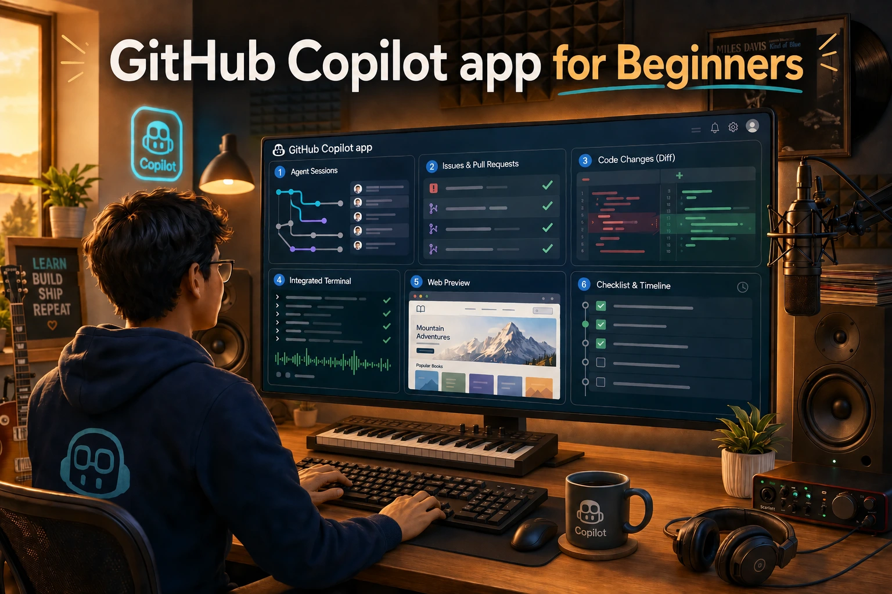
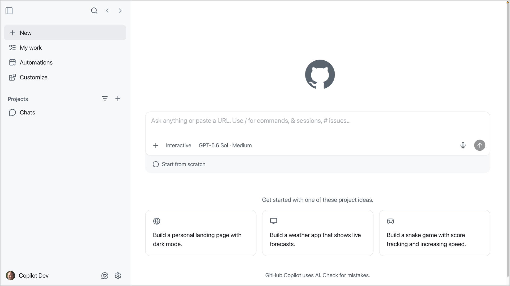
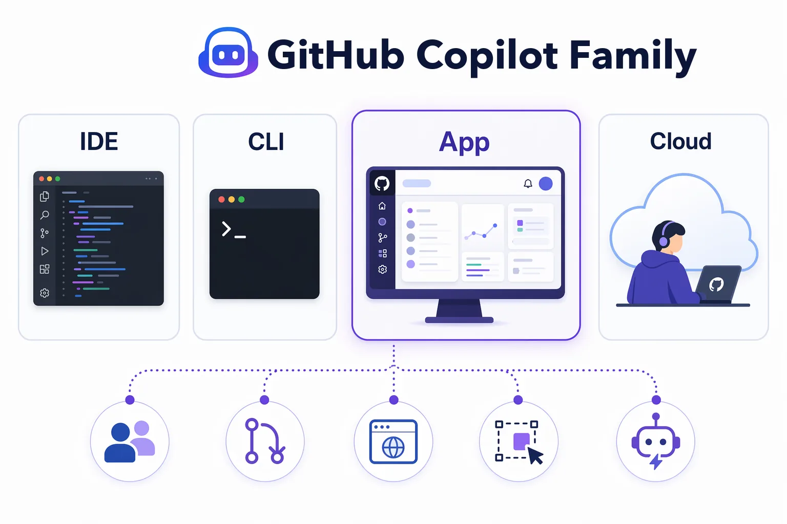

[](./LICENSE)&ensp;
[](https://docs.github.com/en/copilot/concepts/agents/github-copilot-app)&ensp;
[](#target-audience)

🎯 [What You'll Learn](#what-youll-learn) &ensp; 👥 [Target Audience](#target-audience) &ensp; 🤖 [Copilot Family](#understanding-the-github-copilot-family) &ensp; 📚 [Course Structure](#course-structure)

# GitHub Copilot app for Beginners

> Learn to direct and orchestrate AI coding agents from a single desktop app.

Think of the GitHub Copilot app as a desktop cockpit for agentic coding work. Here, *agentic* means AI agents can plan and take actions for you, while you still supervise what they do. The app brings together sessions, plans, diffs, tests, browser previews, AI chats, issues, pull requests, and more so you can guide that work without bouncing between multiple tools.

This course treats the app as a place to guide and review work, not a magic code button. You'll practice choosing context, picking a session mode, checking evidence, and deciding when automation is appropriate to use.



<a id="what-youll-learn"></a>

## 🎯 What You'll Learn

By the end of the course, you'll be able to:

- Install, sign in and set up the GitHub Copilot app
- Start sessions from prompts, issues, and pull requests
- Explain Interactive, Plan, and Autopilot modes
- Use worktree-backed sessions without colliding with your main branch
- Attach and manage agent context
- Review diffs, run tests, preview a web app, and validate changes
- Use *My work* view for issues, PRs, review comments, and failing checks
- Understand where settings, instructions, skills, custom agents, MCP servers, plugins, canvases, and automations fit

The main sample used throughout the course can be found at:

```text
samples/book-app-web
```

## Target Audience

This course is designed for:

- Developers who want to orchestrate, guide, and review agent-driven coding work
- Students and self-taught learners who want a guided path
- Teams evaluating how to keep humans in control while agents do more work
- Copilot CLI or IDE Copilot users who want to understand where the desktop app fits

No agentic development experience is required. Basic GitHub, Git, and JavaScript project familiarity will help. The sample app is a small React/Vite project, so basic npm command familiarity helps in the development chapters. Use the current [Node.js LTS](https://nodejs.org) for `samples/book-app-web`.

The GitHub Copilot app works with a Copilot plan or with your own model provider. Business and Enterprise accounts need the **GitHub Copilot app** policy left enabled. That policy is separate from the Copilot CLI policy.

<a id="understanding-the-github-copilot-family"></a>

## 🤖 Understanding the GitHub Copilot Family

| Product | Where it runs | Best for |
|---|---|---|
| GitHub Copilot app (this course) | Desktop app | Supervising multi-agent sessions, plans, diffs, browser validation, PRs, canvases, and automations |
| GitHub Copilot in IDEs | VS Code, Visual Studio, JetBrains, and other editors | Agents, inline suggestions, chat, and editor-centered coding |
| GitHub Copilot CLI | Terminal | Terminal-native agent work and command-line workflows |
| Copilot cloud agent | GitHub-hosted environment | Background work on issues and cloud sessions when enabled |



This course focuses on the GitHub Copilot app. Along the way, you'll see how it connects to GitHub, local tools, browser previews, terminal output, and cloud capabilities when available.

<a id="course-structure"></a>

## 📚 Course Structure

| Chapter | Title | What learners do |
|:--:|---|---|
| 00 | 🚀 [Setup](./00-setup/README.md) | Prepare the course environment |
| 01 | 👋 [Tour the App](./01-tour-the-app/README.md) | Learn why you'd use the app, then tour key features: UI, Chats, settings, sessions, modes, and model controls |
| 02 | 🌳 [Sessions, Worktrees, and Context](./02-sessions-worktrees-context/README.md) | Start isolated sessions and use `@`, `#`, and `/` for context |
| 03 | ⚡ [Development and GitHub Workflows](./03-development-workflows/README.md) | Review, debug, test, and preview a change, then move it through My work, issues, PRs, review comments, checks, and guided fixes |
| 04 | 🧰 [Skills and Custom Agents](./04-skills-custom-agents/README.md) | Update a review skill, create a read-only custom agent, and validate one skill-guided improvement |
| 05 | 🔌 [MCP Servers and Plugins](./05-mcp-plugins/README.md) | Retrieve documentation through an MCP server and use a plugin's skill for a focused recommendation |
| 06 | 🖼️ [Canvases](./06-canvases/README.md) | Run `/create-canvas` for a visual session board to keep the plan, progress and validation evidence visible |
| 07 | 🔁 [Automations](./07-automations/README.md) | Start with a manual open-work summary, then learn schedules and optional cloud automations |

## 📖 How This Course Works

Each chapter follows the same beginner-friendly pattern:

1. An introduction - why the topic matters
2. A supporting real-world analogy
3. Core agent-development concepts
4. Hands-on examples using `samples/book-app-web`
5. Key takeaways, an assignment, and additional resources

> [!NOTE]
> When a chapter shows a model response, remember that model output varies due to the non-deterministic nature of LLMs. Your app version, model, reasoning setting, repository context, and enabled tools can also change the structure of the response.

## References

- [GitHub Copilot app overview][about-app]
- [Getting started with the app][getting-started]
- [Working with sessions][agent-sessions]
- [Issues and pull requests][issues-prs]
- [Using automations][automations]
- [Working with canvas extensions][canvas-docs]
- [Customizing the GitHub Copilot app][customizing]

## Appendices

- [Glossary](./GLOSSARY.md)
- [Git worktrees](./appendices/git-worktrees.md)
- [Training GitHub scenarios](./appendices/training-github-scenarios.md)
- [Troubleshooting reference](./appendices/troubleshooting-reference.md)
- [Book App Web sample](./samples/book-app-web/README.md)

## Contributing

Course samples are designed to support predictable learning exercises. If you contribute, avoid changing sample behavior unless the course instructions and checks are updated at the same time.

Suggested flow:

1. Fork the repository
2. Create a feature branch
3. Update the relevant course file
4. Verify links and sample commands
5. Open a pull request

## License

This project is licensed under the terms of the MIT open source license. See [LICENSE](./LICENSE) for details.

## Additional References

- [Public app repository][app-readme]
- [GitHub Copilot app changelog][ga-changelog]

[about-app]: https://docs.github.com/copilot/concepts/agents/github-copilot-app
[getting-started]: https://docs.github.com/copilot/how-tos/github-copilot-app/getting-started
[agent-sessions]: https://docs.github.com/copilot/how-tos/github-copilot-app/agent-sessions
[issues-prs]: https://docs.github.com/copilot/how-tos/github-copilot-app/managing-issues-and-pull-requests
[automations]: https://docs.github.com/copilot/how-tos/github-copilot-app/using-automations
[canvas-docs]: https://docs.github.com/copilot/how-tos/github-copilot-app/working-with-canvas-extensions
[customizing]: https://docs.github.com/copilot/how-tos/github-copilot-app/customize-github-copilot-app
[app-readme]: https://github.com/github/app
[ga-changelog]: https://github.com/github/app/blob/main/changelog.md
